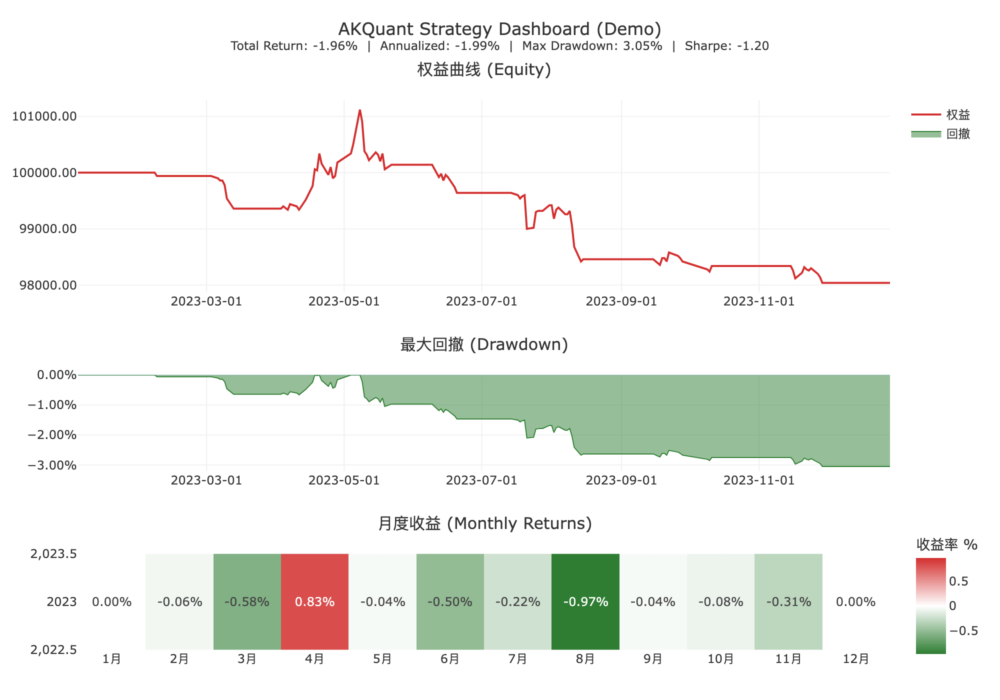

<p align="center">
  
</p>

<p align="center">
    <a href="https://pypi.org/project/akquant/">
        
    </a>
    <a href="https://pypi.org/project/akquant/">
        
    </a>
    <a href="LICENSE">
        
    </a>
    <a href="https://github.com/akfamily/akshare">
        
    </a>
    <a href="https://pepy.tech/projects/akquant">
        
    </a>
</p>

**AKQuant** 是一款专为量化投研设计的**下一代高性能混合框架**。核心引擎采用 **Rust** 编写以确保极致的执行效率，同时提供优雅的 **Python** 接口以维持灵活的策略开发体验。

🚀 **核心亮点：**

*   **高性能内核**：得益于 Rust 的零开销抽象与 **Zero-Copy 数据导入**（`add_arrays` 借用 NumPy 缓冲入引擎；策略侧 `get_history` 等读取则返回安全快照拷贝），AKQuant 在部分回测场景下可显著降低 Python 层开销；实际运行速度取决于策略逻辑、数据规模、回调频率与运行环境。
*   **原生 ML 支持**：内置 **Walk-forward Validation**（滚动训练）框架，无缝集成 PyTorch/Scikit-learn，让 AI 策略开发从实验到回测一气呵成。
*   **TA-Lib 指标生态**：内置 `akquant.talib` 双后端（`python/rust`）兼容能力，支持 **103 个指标**。
*   **因子表达式引擎**：内置 **Polars** 驱动的高性能因子计算引擎，支持 `Rank(Ts_Mean(Close, 5))` 等 Alpha101 风格公式，自动处理并行计算与数据对齐。
*   **参数优化**：内置多进程网格搜索（Grid Search）框架，支持策略参数的高效并行优化。
*   **专业级风控**：内置完善的订单流管理与即时风控模块，支持多资产组合回测。

👉 **[阅读完整文档](https://akquant.akfamily.xyz/)** | **[English Documentation](https://akquant.akfamily.xyz/en/)**

## 安装说明

**AKQuant** 已发布至 PyPI，无需安装 Rust 环境即可直接使用。

```bash
pip install akquant
```

## 快速开始

以下是一个简单的策略示例：

```python
import akquant as aq
import akshare as ak
from akquant import Strategy

# 1. 准备数据
# 使用 akshare 获取 A 股历史数据 (需安装: pip install akshare)
df = ak.stock_zh_a_daily(symbol="sh600000", start_date="20250212", end_date="20260212")


class MyStrategy(Strategy):
    def on_bar(self, bar):
        # 简单策略示例:
        # 当收盘价 > 开盘价 (阳线) -> 买入
        # 当收盘价 < 开盘价 (阴线) -> 卖出

        # 获取当前持仓
        current_pos = self.get_position(bar.symbol)

        if current_pos == 0 and bar.close > bar.open:
            self.buy(symbol=bar.symbol, quantity=100)
            print(f"[{bar.timestamp_iso}] Buy 100 at {bar.close:.2f}")  # UTC ISO 8601

        elif current_pos > 0 and bar.close < bar.open:
            self.close_position(symbol=bar.symbol)
            print(f"[{bar.timestamp_iso}] Sell 100 at {bar.close:.2f}")  # UTC ISO 8601


# 运行回测
result = aq.run_backtest(
    data=df,
    strategy=MyStrategy,
    initial_cash=100000.0,
    symbols="sh600000"
)

# 打印回测结果
print("\n=== Backtest Result ===")
print(result)

# 生成最小基准对比报告
benchmark_returns = (
    df.set_index("date")["close"].pct_change().fillna(0.0).rename("SIMPLE_BENCH")
)
result.report(
    filename="quickstart_report.html",
    show=False,
    benchmark=benchmark_returns,
)
```

调用 `result.report(..., benchmark=...)` 后，报告会新增“基准对比 (Benchmark Comparison)”区块，展示策略/基准/超额累计收益曲线，以及累计超额收益、年化超额收益、跟踪误差、信息比率、Beta、Alpha 等相对指标。

**运行结果示例:**

```text
=== Backtest Result ===
BacktestResult:
                                            Value
start_time              2025-02-12 00:00:00+08:00
end_time                2026-02-12 00:00:00+08:00
duration                        365 days, 0:00:00
total_bars                                    249
closed_trade_count                                  62.0
execution_count                                    124.0
open_position_count                                  0.0
initial_market_value                     100000.0
end_market_value                          99804.0
total_pnl                                  -196.0
unrealized_pnl                                0.0
total_return_pct                           -0.196
annualized_return                        -0.00196
volatility                               0.002402
total_profit                                548.0
total_loss                                 -744.0
total_commission                              0.0
max_drawdown                                345.0
max_drawdown_pct                         0.344487
win_rate                                22.580645
loss_rate                               77.419355
winning_trades                               14.0
losing_trades                                48.0
avg_pnl                                  -3.16129
avg_return_pct                          -0.199577
avg_trade_bars                           1.967742
avg_profit                              39.142857
avg_profit_pct                           3.371156
avg_winning_trade_bars                        4.5
avg_loss                                    -15.5
avg_loss_pct                            -1.241041
avg_losing_trade_bars                    1.229167
largest_win                                 120.0
largest_win_pct                         10.178117
largest_win_bars                              7.0
largest_loss                                -70.0
largest_loss_pct                        -5.380477
largest_loss_bars                             1.0
max_wins                                      2.0
max_losses                                    9.0
sharpe_ratio                            -0.816142
sortino_ratio                           -1.066016
profit_factor                            0.736559
ulcer_index                              0.001761
upi                                     -1.113153
equity_r2                                0.399577
std_error                                68.64863
calmar_ratio                            -0.568962
exposure_time_pct                       48.995984
var_95                                   -0.00023
var_99                                   -0.00062
cvar_95                                 -0.000405
cvar_99                                  -0.00069
sqn                                     -0.743693
kelly_criterion                         -0.080763
max_leverage                              0.01458
min_margin_level                        68.587671
```

## 复杂订单助手 (OCO / Bracket)

AKQuant 提供了两组复杂订单助手，减少手写订单联动逻辑：

*   `place_oco(first_order_id, second_order_id, group_id=None)`：将两个订单绑定为 OCO，任一成交后自动撤销另一单。
*   `place_bracket(symbol, quantity, entry_price=None, stop_trigger_price=None, take_profit_price=None, ...)`：一次性提交 Bracket 结构；进场成交后自动挂出止损/止盈，并在双退出单场景下自动绑定 OCO。

```python
from akquant import OrderStatus, Strategy

class BracketHelperStrategy(Strategy):
    def __init__(self):
        self.entry_order_id = ""

    def on_bar(self, bar):
        if self.get_position(bar.symbol) > 0 or self.entry_order_id:
            return

        self.entry_order_id = self.place_bracket(
            symbol=bar.symbol,
            quantity=100,
            stop_trigger_price=bar.close * 0.98,
            take_profit_price=bar.close * 1.04,
            entry_tag="entry",
            stop_tag="stop",
            take_profit_tag="take",
        )

    def on_order(self, order):
        if order.id == self.entry_order_id and order.status in (
            OrderStatus.Cancelled,
            OrderStatus.Rejected,
        ):
            self.entry_order_id = ""
```

可直接运行完整示例：

```bash
python examples/06_complex_orders.py
```

## 流式回测 (Streaming)

如果你希望在回测执行过程中实时消费事件，可直接使用 `run_backtest` 并传入 `on_event`：

```python
def on_event(event):
    if event["event_type"] == "finished":
        payload = event["payload"]
        print("status:", payload.get("status"))
        print("callback_error_count:", payload.get("callback_error_count"))

result = aq.run_backtest(
    data=df,
    strategy=MyStrategy,
    symbols="sh600000",
    on_event=on_event,
    show_progress=False,
    stream_progress_interval=10,
    stream_equity_interval=10,
    stream_batch_size=32,
    stream_max_buffer=256,
    stream_error_mode="continue",
)
```

`on_event` 为可选参数：不传时保持传统阻塞语义，传入时可实时消费事件。

关键参数：

*   `stream_progress_interval` / `stream_equity_interval`: 进度与权益事件采样间隔
*   `stream_batch_size` / `stream_max_buffer`: 缓冲与批量刷新控制
*   `stream_error_mode`: 回调异常策略，支持 `"continue"` 与 `"fail_fast"`

## 可视化 (Visualization)

AKQuant 内置了基于 **Plotly** 的强大可视化模块，仅需一行代码即可生成包含权益曲线、回撤分析、月度热力图等详细指标的交互式 HTML 报告。

```python
# 生成交互式 HTML 报告，自动在浏览器中打开
result.report(
    show=True,
    compact_currency=True,  # 金额列按 K/M/B 紧凑显示（默认 True）
)

# 如果你希望金额列保留原始数值精度（不缩写），可关闭：
result.report(
    show=False,
    filename="report_raw_amount.html",
    compact_currency=False,
)
```

你也可以直接复用结构化分析结果做二次研究：

```python
exposure = result.exposure_df()             # 暴露分解（净暴露/总暴露/杠杆）
attr_by_symbol = result.attribution_df(by="symbol")
attr_by_tag = result.attribution_df(by="tag")
capacity = result.capacity_df()             # 容量代理（成交率/换手等）
orders_by_strategy = result.orders_by_strategy()         # 按策略归属聚合订单
executions_by_strategy = result.executions_by_strategy() # 按策略归属聚合成交
```

<p align="center">
  
  <br>
  👉 <a href="https://akquant.akfamily.xyz/report_demo/">点击查看交互式报表示例 (Interactive Demo)</a>
</p>

## 文档索引

*   📖 **[核心特性与架构](docs/zh/index.md#核心特性)**: 了解 AKQuant 的设计理念与性能优势。
*   🛠️ **[安装指南](docs/zh/start/installation.md)**: 详细的安装步骤（含源码编译）。
*   🚀 **[快速入门](docs/zh/start/quickstart.md)**: 更多示例与基础用法。
*   🤖 **[机器学习指南](docs/zh/advanced/ml.md)**: 如何使用内置的 ML 框架进行滚动训练。
*   📚 **[API 参考](docs/zh/reference/api.md)**: 详细的类与函数文档。
*   💻 **[贡献指南](CONTRIBUTING.md)**: 如何参与项目开发。

## 🧪 测试与质量保证

AKQuant 采用严格的测试流程以确保回测引擎的准确性：

*   **单元测试**: 覆盖核心 Rust 组件与 Python 接口。
*   **黄金测试 (Golden Tests)**: 使用合成数据验证关键业务逻辑（如 T+1、涨跌停、保证金、期权希腊值），并与锁定的基线结果进行比对，防止算法回退。

运行测试：
```bash
# 1. 使用 uv 环境运行命令
uv sync

# 2. 构建并绑定 Rust 扩展
# 注意：不要使用 `uv run maturin develop`，它会先尝试安装当前项目，
# 对于以 maturin 作为 build backend 的仓库可能卡在 Preparing packages。
uvx maturin develop

# 3. 运行所有测试
uv run pytest

# 4. 运行 Rust 核心测试（自动处理 macOS + uv 环境动态库路径）
./scripts/cargo-test.sh -q

# 5. 仅运行黄金测试
uv run pytest tests/golden/test_golden.py
```

## Citation

Please use this bibtex if you want to cite this repository in your publications:

```bibtex
@misc{akquant,
    author = {Albert King and Yaojie Zhang and Chao Liang},
    title = {AKQuant},
    year = {2026},
    publisher = {GitHub},
    journal = {GitHub repository},
    howpublished = {\url{https://github.com/akfamily/akquant}},
}
```

## License

MIT License
