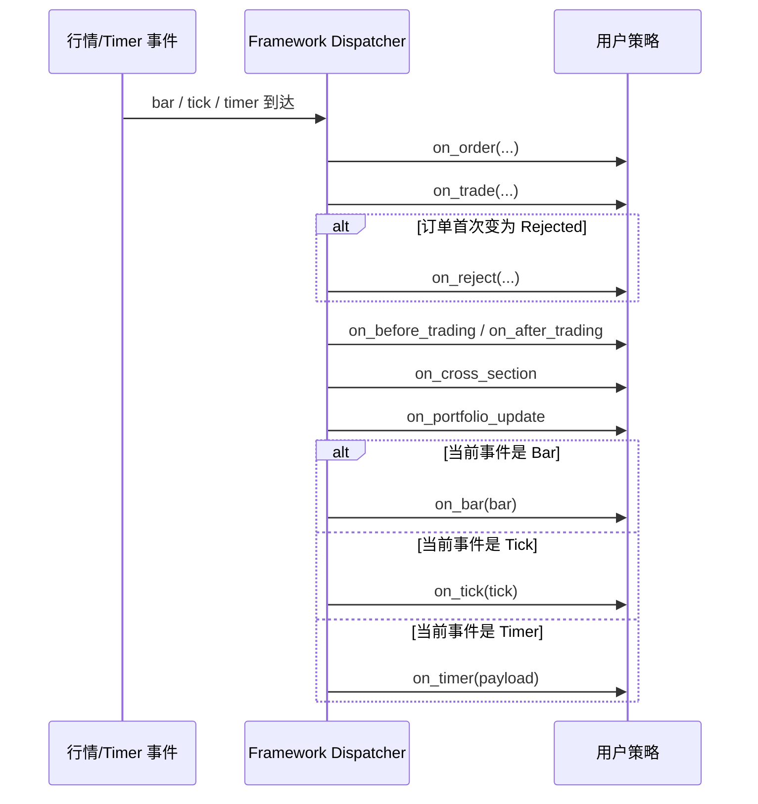
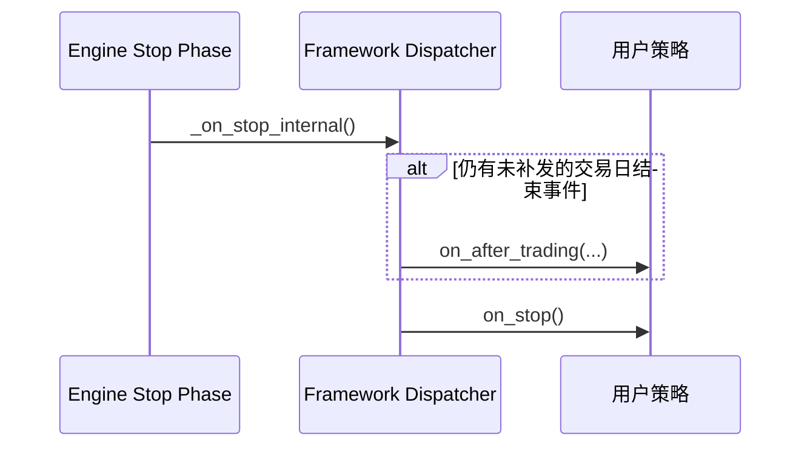

# 策略编写指南

本文档旨在帮助策略开发者快速掌握 AKQuant 的策略编写方法。

## 1. 核心概念 (Glossary)

对于量化交易的新手，这里有一些基础术语的解释：

*   **Bar (K线)**: 包含了某一段时间（如1分钟、1天）内的市场行情，主要包含 5 个数据：
    *   **Open**: 开盘价
    *   **High**: 最高价
    *   **Low**: 最低价
    *   **Close**: 收盘价
    *   **Volume**: 成交量
*   **Strategy (策略)**: 你的交易机器人。它的核心工作就是不断地看行情 (on_bar)，然后决定买 (buy) 还是卖 (sell)。
*   **Context (上下文)**: 机器人的“记事本”和“工具箱”。里面记录了当前有多少钱 (cash)、有多少股票 (positions)，也提供了下单的工具。
*   **Position (持仓)**: 你当前持有的股票或期货数量。正数表示多头（买入持有），负数表示空头（借券卖出）。
*   **Backtest (回测)**: 历史模拟。用过去的数据来测试你的策略，看看如果过去这么做，能赚多少钱。

## 2. 策略生命周期

一个策略从开始到结束，会经历以下几个阶段：

* `__init__`: Python 对象初始化，适合定义参数。
* `on_start`: 策略启动时调用，**必须**在此处使用 `self.subscribe()` 订阅数据，也可在此注册指标。如果是热启动，需注意不要覆盖已恢复的状态。
* `on_resume`: **仅在热启动时调用**（在 `on_start` 之前）。用于处理从快照恢复后的特殊逻辑。
* `on_bar`: 每一根 K 线闭合时触发 (核心交易逻辑)。
* `on_tick`: 每一个 Tick 到达时触发 (高频/盘口策略)。
* `on_order`: 订单状态变化时触发 (如提交、成交、取消)。
* `on_trade`: 收到成交回报时触发。
* `on_reject`: 订单进入 `Rejected` 状态时触发。
* `on_before_trading` / `on_after_trading`: 交易日级钩子。
* `on_pre_open`: 开盘前最后一个合法决策点，适合“盘前信号，本次 open 成交”。
* `on_cross_section`: 当日首个跨标的完整 bar 切片就绪后触发（每天最多一次，适合基于当日 bar/账户快照做横截面同周期调仓）。
* `on_portfolio_update`: 账户快照变化时触发。
* `on_error`: 用户回调抛异常时触发，默认触发后继续抛出异常。
* `on_timer`: 定时器触发时调用 (需手动注册)。
*   `on_stop`: 策略停止时调用，适合进行资源清理或结果统计。
*   `on_train_signal`: 滚动训练触发信号 (仅在 ML 模式下触发)。

### 2.0 回调速查表

| 回调 | 何时触发 | 典型用途 | 示例入口 |
| :--- | :--- | :--- | :--- |
| `on_start` | 策略实例启动后 | 订阅标的、注册指标、初始化运行态资源 | `examples/textbook/ch05_strategy.py` |
| `on_resume` | 热启动恢复时，且早于 `on_start` | 恢复连接、打印恢复状态、处理快照续跑逻辑 | `examples/21_warm_start_demo.py`、`examples/56_functional_warm_start_demo.py` |
| `on_bar` | 每根 Bar 闭合时 | 主交易逻辑、指标更新、信号计算 | `examples/01_quickstart.py` |
| `on_tick` | 每个 Tick 到达时 | 高频/盘口响应、逐笔监控 | `examples/51_class_tick_callbacks_demo.py` |
| `on_order` | 订单状态变化时 | 跟踪下单生命周期、联动撤单/重置状态 | `examples/08_event_callbacks.py` |
| `on_trade` | 收到成交回报时 | 成交日志、成交后风控、累计统计 | `examples/08_event_callbacks.py` |
| `on_reject` | 订单首次进入 `Rejected` 时 | 记录拒单原因、告警、降级处理 | `examples/50_framework_hooks_demo.py` |
| `on_before_trading` | 本地交易日首次进入 `Normal` 会话 | 盘前检查、生成交易日级信号 | `examples/50_framework_hooks_demo.py` |
| `on_pre_open` | 每个交易日首个常规行情事件前，由框架定时器抢先触发 | 盘前信号与“本次 open 成交”语义钩子；可用于表达集合竞价前的最后决策点，但不等同于券商柜台已支持集合竞价专用委托 | `examples/52_pre_open_demo.py` |
| `on_cross_section` | 当日首个跨标的完整 bar 切片之后 | 基于当日 bar/账户快照的横截面同周期调仓 | `examples/strategies/09_stock_momentum_rotation_after_bar.py` |
| `on_after_trading` | 离开 `Normal` 会话时，必要时下一事件补发 | 日终统计、收盘后清理与归档 | `examples/50_framework_hooks_demo.py` |
| `on_portfolio_update` | 账户快照变化时增量触发 | 监控现金/权益变化、推送 UI 或告警 | `examples/50_framework_hooks_demo.py` |
| `on_error` | 任一用户回调抛异常时 | 记录异常源、决定继续/中断策略 | `examples/22_strategy_runtime_config_demo.py` |
| `on_timer` | 定时器到点时 | 定时调仓、盘前任务、节律性检查 | `examples/strategies/07_stock_momentum_rotation_on_timer.py` |
| `on_stop` | 策略停止时 | 汇总统计、资源释放、打印总结 | `examples/textbook/ch05_strategy.py` |
| `on_expiry` | 引擎实际执行到期结算/移除后 | 处理换月、记录结算、清理失效合约 | `examples/49_on_expiry_demo.py` |
| `on_train_signal` | ML 滚动训练窗口触发时 | 训练模型、切换待激活模型 | `examples/10_ml_walk_forward.py`、`examples/55_functional_ml_walk_forward.py` |

其中，`on_before_trading`、`on_after_trading`、`on_portfolio_update`、`on_reject` 这类框架级钩子，推荐直接运行 `examples/50_framework_hooks_demo.py` 观察触发顺序与日志输出。
如果你的目标是“盘前决策，但希望成交价仍是当日 open”，优先看 `examples/52_pre_open_demo.py`，不要再用通用 `on_timer` 模拟该语义。
如果你只想先看一份“最常用回调的一站式示例”，优先运行 `examples/08_event_callbacks.py`；它把 `on_start/on_bar/on_order/on_trade/on_reject/on_timer/on_portfolio_update/on_stop` 放到了同一个脚本里。
如果你要写类风格的 Tick 策略，先看 `examples/51_class_tick_callbacks_demo.py`；如果你更偏好函数式入口，再看 `examples/24_functional_tick_simulation_demo.py`。

### 2.1 回调触发契约

对于每个 `bar/tick/timer` 事件，框架按以下顺序分发回调：

1. `on_order` / `on_trade`（若拒单则额外触发 `on_reject`）
2. 框架钩子（`on_before_trading`/`on_after_trading`、`on_portfolio_update`）
3. 用户事件回调（`on_bar` / `on_tick` / `on_timer`）

说明：

* `on_reject` 对同一订单 id 只触发一次。
* 回测中已终态拒单会通过上下文快照 `recent_rejected_orders` 在下一次事件分发时补发，避免因清理活跃订单导致漏触发。
* `on_before_trading` 在本地交易日首次进入常规交易会话时触发一次；默认回测路径下该会话通常表现为 `Continuous`。
* `on_pre_open` 在每个交易日的首个常规行情事件前，由框架预注册 timer 先触发一次。
* `on_before_trading` 始终按“前一交易日/前一时点信息可见”的语义工作；在该回调里，`get_history()`、`get_account()`、`equity` 不应看到当日新 bar 或当日更新后的账户视图。
* `on_cross_section` 会在框架见到当日首个“跨标的完整切片”后触发；在该回调里，可以看到当日历史和当前账户快照。
* `on_after_trading` 是**结束/收尾型钩子**，定位为日终的统计、清理与归档。框架已让它在**当日收盘点的独立事件**（早于下一根 bar）触发，因此在其中提交的 `NextOpen()` 单会落在下一根 bar（而非再晚一格，#324）。但若你的意图是“收盘决策、次日开盘成交”，更清晰的写法是在 `on_bar`（next-open）或 `on_pre_open` 中下单。
* **`TimeInForce.Day` 与 next-open 的过期语义**：日终结算会把当日仍未成交的 Day 单置为 `Expired`。对于在收盘后（如 `on_cross_section` / `on_after_trading`）提交的 `NextOpen()` next-open Day 单，其唯一可撮合切片是**次日开盘**，晚于结算时点——框架据此豁免这类订单一次，让它先获得次日开盘的成交机会；只有当次日开盘仍未成交（如次日停牌），才在次日结算时过期（#334）。同一时点成交（`CurrentClose()`）的 Day 单其可撮合切片就在创建当日，因此仍在次日结算时按常规过期。若希望“收盘决策、次日成交”的委托不受当日过期约束，也可直接使用默认的 `GTC`。
* 需要按**会话**(如期货日盘/夜盘)分支时,框架不再提供 `on_session_*` 回调;请在 `on_bar` / `on_tick` 内读取 `self.ctx.session`(`TradingSession` 枚举)自行判断,例如 `if self.ctx.session == TradingSession.Continuous: ...`。
* `on_pre_open` 内若直接调用 `buy/sell/order_target_*` 且未显式传 `fill_mode`，框架会自动按 `NextOpen()`（下一根 open 成交）解析。
* 这里表达的是框架侧“盘前决策，本次 open 成交”的时序语义，不等同于交易所或券商柜台已经实现了集合竞价专用报单、撤单窗口控制或专有价格类型。
* 新股/新债打新不属于 `on_pre_open` 或当前统一 `submit_order(...)` 的默认承诺范围；若要支持，通常需要补齐 broker 专有字段与业务路由。
* 若需要更精确的交易日边界触发，可在策略中设置 `self.enable_precise_day_boundary_hooks = True`；该开关只影响 `on_before_trading` / `on_after_trading` 的触发精度，不改变这些日边界回调中的历史数据与账户快照可见窗口。
* `on_portfolio_update` 采用增量触发：初始化时触发一次，后续仅在订单/成交或持仓相关价格变化时触发。
* 可通过 `self.portfolio_update_eps` 过滤微小资产波动（默认 `0.0`，即不过滤）。
* 停止阶段会在 `on_stop` 之前补发待触发的 `on_after_trading`。
* `on_error` 参数为 `(error, source, payload)`，推荐通过 `self.error_mode = "raise" | "continue"` 控制行为（默认 `raise`）。`self.re_raise_on_error` 仍兼容，作为兜底开关。
* 推荐使用 `self.runtime_config = StrategyRuntimeConfig(...)` 统一配置上述行为开关。
* 旧别名字段与 `runtime_config` 会自动保持同步。

#### 2.1.1 常规事件分发时序



#### 2.1.2 停止阶段补发时序



#### 2.1.3 何时使用 `on_pre_open`

推荐使用 `on_pre_open` 的场景：

* 你在集合竞价、盘前扫描、开盘前风控检查后形成信号。
* 你希望订单默认按“本次 open 成交”建模，而不是等下一根 bar。
* 你需要一个语义明确的框架钩子，而不是自己维护一套定时器协议。

不推荐继续用通用 `on_timer` 代替的场景：

* 需要严格表达“盘前信号，本次 open 成交”。
* 需要让团队成员一眼看懂策略意图。

三者区别：

* `on_before_trading`: 交易日级语义钩子，强调“这一天开始了”。
* `on_pre_open`: 撮合语义钩子，强调“这是开盘前最后一个可下单点”。
* `on_timer`: 通用调度工具，适合节律任务，不适合承载专门的开盘成交语义。

推荐模板：

```python
class AuctionSignalStrategy(Strategy):
    def __init__(self) -> None:
        self.pending_dates = set()

    def on_start(self) -> None:
        self.subscribe("000001")

    def on_pre_open(self, event: dict[str, object]) -> None:
        trading_date = event["trading_date"]
        if trading_date in self.pending_dates:
            return

        self.pending_dates.add(trading_date)

        signal = self.compute_pre_open_signal()
        if signal > 0:
            # 不显式传 fill_mode 时，默认按 NextOpen()（当日 open）语义处理
            self.buy("000001", quantity=100)
        elif signal < 0:
            self.sell("000001", quantity=100)
```

实践建议：

* `on_pre_open` 里尽量只放“最后决策”和“下单”逻辑。
* 盘前扫描、候选池更新、风控检查可以提前准备，但最终是否成交的决策留在 `on_pre_open`。
* 如果你显式传入 `fill_mode`（`FillMode` 对象），将以你的显式配置为准。

时序提醒：

* 不要把 `on_before_trading` 当成“同一天稳定先于 `on_pre_open` 的准备阶段”。
* 默认路径下，`on_pre_open` 发生在首个常规事件之前，而 `on_before_trading` 通常发生在进入 `Normal` 会话后的首个常规事件上。
* 即使启用 `enable_precise_day_boundary_hooks`，`on_before_trading` 的边界 timer 也不应被当作 `on_pre_open` 的同日准备链路来依赖。
* 如果你想做“双阶段”最佳实践，推荐用“前一交易日更晚的回调先准备，下一交易日 `on_pre_open` 再下单”，例如前一日 `on_timer` 或 `on_after_trading`。
* 参考示例：`examples/53_timer_to_pre_open_demo.py`。

## 3. 风险管理 (Risk Management)

AKQuant 内置了强大的预交易风控模块，支持在 Engine 层面拦截不合规的订单。

你可以在回测脚本中（Engine 初始化后）配置这些规则：

```python
from akquant import Engine

engine = Engine()
# ... 添加数据 ...

# 获取风控管理器 (注意：PyO3 返回的是副本，修改后需赋值回去)
rm = engine.risk_manager

# 1. 单标的持仓上限 (例如 10%)
# 如果买入导致某标的持仓市值占总权益超过 10%，则拒绝订单
rm.add_max_position_percent_rule(0.10)

# 2. 行业集中度限制 (例如科技股不超过 20%)
# 需要提供 Symbol -> Sector 的映射字典
sector_map = {"AAPL": "Tech", "MSFT": "Tech", "XOM": "Energy"}
rm.add_sector_concentration_rule(0.20, sector_map)

# 3. 总杠杆率熔断 (例如 1.5倍)
# 总敞口 / 总权益 > 1.5 时拒绝开仓
# 对于高杠杆策略，建议关闭默认的现金检查 (check_cash=False)
rm.config.check_cash = False
rm.add_max_leverage_rule(1.5)

# 4. 账户最大回撤限制 (例如 20%)
# 当前权益相对历史峰值回撤超过阈值时，拒绝新订单
rm.add_max_drawdown_rule(0.20)

# 5. 单日亏损限制 (例如 5%)
# 当日权益相对当日首个风控检查时点下跌超过阈值时，拒绝新订单
rm.add_max_daily_loss_rule(0.05)

# 6. 账户净值止损阈值 (例如 80%)
# 当前权益低于“规则首次生效时权益 * 阈值”时，拒绝新订单
rm.add_stop_loss_rule(0.80)

# 应用配置
engine.risk_manager = rm

# 运行回测
engine.run(strategy=MyStrategy)
```

通过 `run_backtest` 统一入口也可直接配置账户级风控：

```python
from akquant import run_backtest
from akquant.config import RiskConfig

result = run_backtest(
    data=data,
    strategy=MyStrategy,
    risk_config=RiskConfig(
        max_account_drawdown=0.20,
        max_daily_loss=0.05,
        stop_loss_threshold=0.80,
    ),
)
```

账户级参数建议（可作为起步值）：

| 风格 | `max_account_drawdown` | `max_daily_loss` | `stop_loss_threshold` |
| :--- | :--- | :--- | :--- |
| 保守 | `0.10` | `0.02` | `0.90` |
| 中性 | `0.20` | `0.05` | `0.80` |
| 激进 | `0.30` | `0.08` | `0.70` |

建议先从“中性”起步，再根据策略波动与换手逐步收紧或放宽。

### 3.1 信用账户回测（融资/融券）

若策略需要在回测中启用融资买入或融券卖出，可在 `RiskConfig` 中显式切换到账户模式 `margin`：

```python
from akquant.config import RiskConfig

risk_config = RiskConfig(
    account_mode="margin",
    enable_short_sell=True,
    initial_margin_ratio=0.5,
    maintenance_margin_ratio=0.3,
    financing_rate_annual=0.08,
    borrow_rate_annual=0.10,
    allow_force_liquidation=True,
    liquidation_priority="short_first",
)
```

常用字段说明：

- `account_mode`: `"cash"` / `"margin"`。
- `enable_short_sell`: `True` 时允许股票开空。
- `initial_margin_ratio`: 初始保证金比例（影响可开仓规模）。
- `maintenance_margin_ratio`: 维持担保比例阈值。
- `allow_force_liquidation`: 维持担保比例跌破阈值时是否触发强平。
- `liquidation_priority`: `"short_first"` 或 `"long_first"`。

策略中可通过 `get_account()` 读取信用账户扩展字段：

```python
snap = self.get_account()
print(
    snap["account_mode"],
    snap["borrowed_cash"],
    snap["short_market_value"],
    snap["maintenance_ratio"],
    snap["accrued_interest"],
    snap["daily_interest"],
)
```

如果策略运行在期货保证金账户语义下，还应重点关注这些字段：

- `snap["equity"]`: 当前账户权益。
- `snap["used_margin"]` / `snap["margin"]`: 当前已占用保证金。
- `snap["free_margin"]`: 可用保证金（`equity - used_margin`），即可用于新开仓的资金；下单因保证金不足被拒时日志里的 `Available` 就是此值，不要用 `cash` 去比较。
- `snap["notional_value"]`: 当前期货名义敞口。
- `snap["unrealized_pnl"]`: 当前浮动盈亏。

说明：

- 期货保证金账户开仓不会像股票现货买入那样扣减全额名义本金。
- 因此，期货场景下应优先用 `equity` 观察账户净值变化，用 `used_margin` 观察保证金占用，用 `notional_value` 观察杠杆敞口。
- 如果只需要一个“当前总权益”数值，优先使用 `equity`，其口径与 `get_account()["equity"]` 对齐。

## 4. 常用工具 (Utilities)

AKQuant 提供了一系列便捷工具来简化策略开发。

### 3.1 日志记录 (Logging)

使用 `self.log()` 可以输出带有当前**回测时间戳**的日志，方便调试和记录。

```python
def on_bar(self, bar):
    # 自动添加时间戳，例如: [2023-01-01 09:30:00] 信号触发: 买入
    self.log("信号触发: 买入")

    # 支持指定日志级别
    import logging
    self.log("资金不足", level=logging.WARNING)
```

如果你已经通过 `akquant.configure_logging(...)` 或 `akquant.register_logger(...)` 配置了日志处理器，`self.log()` 还会自动附带结构化上下文，便于在 `live` profile 或文件日志中排障：

* `phase`: 当前日志阶段，例如 `strategy`、`order`、`trade`
* `strategy_id` / `slot`: 多策略场景下的策略身份
* `symbol`: 当前标的
* `event_time`: 策略事件时间
* `order_id` / `client_order_id`: 在 `on_order` / `on_trade` / `on_reject` 内会自动补齐

最简单的方式仍然是兼容接口：

```python
import akquant

akquant.register_logger(level="INFO")
```

如果你想区分 research / optimize / live 场景，推荐使用结构化配置接口：

```python
import akquant

akquant.configure_logging(
    akquant.LogConfig(
        profile="live",
        level="INFO",
        console=True,
        filename="logs/strategy.log",
        file_level="DEBUG",
        file_json=True,
        file_max_bytes=10_000_000,
        file_backup_count=5,
    )
)
```

如果你要把日志送到日志平台或采集系统，也可以为控制台或文件单独开启 JSON 输出：

* `console_json=True`: 控制台输出 JSON line
* `file_json=True`: 文件输出 JSON line

实践建议：

* 人类阅读的调试信息优先用 `self.log()`
* 需要统一消费 `order/trade/progress/risk` 事件流时，优先用 `run_backtest(..., on_event=...)`
* 如果你在 `on_order`、`on_trade`、`on_reject` 里写 `self.log()`，通常不需要再手动拼接订单 id
* 如果你启用了 `akquant` logger handler，Rust 执行链路里的 warning 也会进入同一套输出。例如保证金不足拒单、收盘过期、取消未知订单、同一切片内 `same-cycle` 延后等日志，会自动带上 `phase=execution`，并在可用时附带 `symbol`、`order_id`、`strategy_id`、`slot`、`event_time_iso`；其中 `event_time_iso` 统一为 UTC ISO 8601

#### 日志级别语义

AKQuant 统一约定各级别的语义，便于按级别过滤与告警：

| 级别 | 语义 | 量化场景示例 |
| :--- | :--- | :--- |
| `DEBUG` | 细粒度诊断，仅排障时开启 | 清理/推断失败的兜底分支 |
| `INFO` | 正常运行的关键节点 | 订单提交/成交/撤单审计、训练进度、快照保存 |
| `WARNING` | 可恢复的降级或非预期但不致命 | 保证金不足拒单、忽略不可撤订单、数据字段非法回退默认值 |
| `ERROR` | 操作失败且不可恢复 | 自定义撮合回调抛异常导致订单未执行、Parquet 数据流读取/解析失败（样本被截断）|
| `CRITICAL` | **系统级致命，需人工立即介入** | 实盘交易前置断连（无法下单）、实盘 runner 因未捕获异常整体停止 |

> `CRITICAL` 只用于「框架已无法安全执行核心职能」的场景。实盘部署时建议对 `CRITICAL` 单独接告警通道（如短信/电话），与普通日志分流。

#### 订单审计与敏感信息

* **订单生命周期审计**：`broker_live` 下每一笔订单的 提交 / 回报 / 成交 / 撤单 / 拒单 都会经 `akquant.audit.order` 命名空间产出结构化 INFO 审计日志（含 `client_order_id`、`order_id`、`event`、`price`、`quantity` 等）。通过 `LogConfig(order_audit_file="logs/orders_audit.log")` 可另存一份纯审计 JSON 流，用于事后对账与复盘——**进程停止后仍可仅凭该文件重建订单生命周期**。
* **敏感信息脱敏**：日志默认对密钥类字段（`password`/`token`/`api_key` 等）全掩码、对账户类字段（`user_id`/`account` 等）保留尾 4 位。此为 handler 层兜底，任何调用点忘记脱敏也不会泄漏；如需关闭，设 `LogConfig(mask_sensitive=False)`。

在控制台里，审计日志的 message 是**自包含**的（如 `fill Buy 100 600000.SH @10.55 [C1->B1 T1]`），一眼可读、不再追加冗余的结构化后缀；而完整结构化字段仍进 JSON 审计文件供机器对账。

#### 日志语言（默认英文，可选中文控制台）

AKQuant 的日志遵循业界惯例（对标 nautilus_trader / structlog）：**message 默认英文**——作为可搜索、可协作、可被告警/日志系统消费的通用契约；**结构化字段永远英文**（`event=order_fill`、`side`、`price`…），语言开关不影响它们。

如果你更习惯中文控制台，可开 `language="zh"`：

```python
akquant.configure_logging(akquant.LogConfig(profile="live", language="zh"))
```

它只把**控制台的订单审计行**按中文模板从结构化字段重新渲染（如 `成交 Buy 100 600000.SH @10.55 [C1→B1 T1]`）；**文件与 JSON 审计流恒为英文**，因此 grep/对账/告警不会因语言分裂。散文类诊断日志（连接/登录/结算等）统一英文，不随该开关变化。

#### 实盘推荐日志配置

高频策略实盘时，逐笔审计（提交/回报/成交）默认 INFO，会在控制台刷屏。推荐把**控制台调高到 `WARNING`**（只看告警/拒单/断连等需要人关注的事件），把**完整 INFO 审计单独落到 `order_audit_file`**（脱机对账、复盘的凭证）：

```python
import akquant

akquant.configure_logging(
    akquant.LogConfig(
        profile="live",
        console=True,
        console_level="WARNING",          # 控制台只留需要人关注的事件
        filename="logs/live.log",         # 主日志（含 INFO）落文件
        file_level="INFO",
        order_audit_file="logs/orders_audit.log",  # 纯订单审计 JSON 流
        order_audit_level="INFO",
        # language="zh",                  # 可选：控制台审计行渲染中文（文件仍英文）
    )
)
```

这样：控制台清爽（拒单 `WARNING`、断连 `CRITICAL` 才跳出来），而每一笔订单的完整生命周期都留在 `orders_audit.log`，进程停止后仍可仅凭它重建与对账。

### 3.2 便捷数据访问 (Data Access)

为了减少代码冗余，`Strategy` 类提供了当前 Bar/Tick 数据的快捷访问属性：

| 属性 | 说明 | 对应原始代码 |
| :--- | :--- | :--- |
| `self.symbol` | 当前标的代码 | `bar.symbol` / `tick.symbol` |
| `self.close` | 当前最新价 | `bar.close` / `tick.price` |
| `self.open` | 当前开盘价 | `bar.open` (Tick 模式为 0) |
| `self.high` | 当前最高价 | `bar.high` (Tick 模式为 0) |
| `self.low` | 当前最低价 | `bar.low` (Tick 模式为 0) |
| `self.volume` | 当前成交量 | `bar.volume` / `tick.volume` |

**示例**：
```python
def on_bar(self, bar):
    # 旧写法
    if bar.close > bar.open: ...

    # 新写法 (更简洁)
    if self.close > self.open:
        self.buy(self.symbol, 100)
```

### 3.3 定时器 (Timer)

除了底层的 `schedule` 方法，AKQuant 提供了更便捷的定时任务注册方式：

*   **`schedule_daily(time_str, payload)`**: 每个交易日在指定时间触发。
    *   **支持实盘**: 在回测模式下预生成所有触发时间；在实盘模式下，每日自动调度下一次触发。
*   **`schedule_weekly(time_str, payload)`** / **`schedule_monthly(time_str, payload)`**: 在每周/每月的**首个交易日**触发（节假日或停牌自动顺延）。仅回测（交易日历已知）有效。
*   **`schedule(trigger_time, payload)`**: 在指定时间点（一次性）触发。月末、偏移、每两周等非常规节奏，可用 `self.trading_days` 与 `nth_trading_day_of_month/week` 等日历辅助自行枚举，再逐个调 `schedule`。

> 提示：若目的是横截面/定期调仓，优先使用 `on_cross_section`（由框架托管、成交时序对齐）；`schedule_*` + `on_timer` 面向通用自定义时点任务。

```python
def on_start(self):
    # 每天 14:55:00 触发收盘检查
    self.schedule_daily("14:55:00", "daily_check")

    # 在特定日期时间触发
    self.schedule("2023-01-01 09:30:00", "special_event")

def on_timer(self, payload):
    if payload == "daily_check":
        self.log("Running daily check...")
```

### 3.4 横截面策略推荐范式 (Cross-Section Pattern)

AKQuant 的 `on_bar` 按“单事件流”逐条触发。若你要做多标的横截面比较（轮动、排序、打分），推荐使用日界钩子，由框架保证“每天最多一次”的触发语义：用 `on_before_trading` 做“前一交易日信息可见”的盘前横截面准备与调仓；若需“看到当日所有标的的当拍 bar 后再同周期调仓”，用 `on_cross_section`。

推荐步骤：

1. 在 `on_start` 中定义 `universe` 并订阅标的。
2. 在 `on_before_trading` 中遍历 `universe` 计算分数。
3. 在 `on_before_trading` 中统一选股与调仓。

```python
class CrossSectionStrategy(Strategy):
    def __init__(self, lookback=20):
        self.lookback = lookback
        self.universe = ["sh600519", "sz000858", "sh601318"]
        self.warmup_period = lookback + 1

    def on_start(self):
        for symbol in self.universe:
            self.subscribe(symbol)

    def on_before_trading(self, trading_date, timestamp):
        history_map = self.get_history_map(
            count=self.lookback,
            symbols=self.universe,
            field="close",
        )
        scores = {}
        for symbol, closes in history_map.items():
            if len(closes) < self.lookback:
                continue
            scores[symbol] = (closes[-1] - closes[0]) / closes[0]
        if not scores:
            return
        self.rebalance_to_topn(
            scores=scores,
            top_n=2,
            weight_mode="score",
            long_only=False,
        )
```

完整示例见：`examples/strategies/05_stock_momentum_rotation_timer.py`（`on_before_trading`）、`examples/strategies/09_stock_momentum_rotation_after_bar.py`（`on_cross_section`）以及 `examples/strategies/07_stock_momentum_rotation_on_timer.py`（`on_timer` 固定时点版本）。

### 3.5 横截面方案 B：收齐同 timestamp 后执行

当策略没有固定调仓时点（不方便用 `on_timer`）时，可在 `on_bar` 中先缓存同一时间片的标的，收齐后再执行一次横截面逻辑。

```python
from collections import defaultdict

class CrossSectionBucketStrategy(Strategy):
    def __init__(self, lookback=20):
        self.lookback = lookback
        self.universe = ["sh600519", "sz000858", "sh601318"]
        self.warmup_period = lookback + 1
        self.pending = defaultdict(set)

    def on_bar(self, bar):
        self.pending[bar.timestamp].add(bar.symbol)
        if len(self.pending[bar.timestamp]) < len(self.universe):
            return
        self.pending.pop(bar.timestamp, None)
        scores = {}
        for symbol in self.universe:
            closes = self.get_history(count=self.lookback, symbol=symbol, field="close")
            if len(closes) < self.lookback:
                return
            scores[symbol] = (closes[-1] - closes[0]) / closes[0]
        best = max(scores, key=lambda s: scores[s])
        self.order_target_percent(target_percent=0.95, symbol=best)
```

完整示例见：`examples/strategies/06_stock_momentum_rotation_bucket.py`。

### 3.6 方案选型对照 (A vs B)

| 维度 | 方案 A：`on_timer` 统一执行 | 方案 B：收齐 `timestamp` 后执行 |
| :--- | :--- | :--- |
| 触发方式 | 固定时点触发（如 14:55） | 事件驱动，时间片收齐触发 |
| 稳健性 | 高，不依赖到达顺序 | 中，需维护缓存并处理缺失 |
| 实现复杂度 | 低，逻辑集中 | 中，需管理 `timestamp -> symbols` |
| 适用场景 | 日频/定时调仓、生产默认 | 无固定调仓时点的横截面策略 |
| 常见风险 | 定时器时间与数据频率不匹配 | 某些标的缺失导致不触发 |

建议：优先使用方案 A；只有在无法定义稳定调仓时点时再采用方案 B。

### 3.7 横截面常见坑位清单

*   **停牌/缺失数据**：某些标的当日无 Bar 时，方案 B 可能不触发；可设置超时降级，或允许“有效样本数达阈值”即执行。
*   **Universe 漂移**：成分股调整后若仍用旧列表，会出现权重与真实池不一致；建议定期刷新并记录生效日期。
*   **调仓时点与成交策略错配**：例如 `fill_policy=NextOpen()` 时，收盘时点信号会在下一根撮合；若用 `CurrentClose(...)`，应结合 `timer_fill_timing` 明确 timer 是否当期成交。
*   **历史长度不足**：新上市或停牌恢复标的数据窗口不完整；评分前统一做 `len(closes)` 检查并跳过不足样本。
*   **仓位未收敛**：多标的先卖后买若资金未及时释放，可能导致买入不足；可采用目标仓位 API 并在下一时点二次收敛。

完整上线检查可参考：[横截面策略实战清单](cross_section_checklist.md)。

## 5. 策略风格选择 {: #style-selection }

AKQuant 提供了两种风格的策略开发接口：

风格选择建议可参考：[策略风格决策指南](../advanced/strategy_style_decision.md)。

| 特性 | 类风格 (推荐) | 函数风格 |
| :--- | :--- | :--- |
| **定义方式** | 继承 `akquant.Strategy` | 定义 `initialize` + `on_bar`（必选），可选 `on_start` / `on_stop` / `on_tick` / `on_order` / `on_trade` / `on_timer` |
| **适用场景** | 复杂策略、需要维护内部状态、生产环境 | 快速原型验证、迁移 Zipline/Backtrader 策略 |
| **代码结构** | 面向对象，逻辑封装性好 | 脚本化，简单直观 |
| **API 调用** | `self.buy()`, `self.ctx` | `ctx.buy()`, `ctx` 作为参数传递 |

### 5.1 函数式回调触发前提

| 回调 | 触发前提 | 说明 |
| :--- | :--- | :--- |
| `on_bar(ctx, bar)` | 回测数据流产生 Bar 事件 | 函数式策略的必选主回调 |
| `on_start(ctx)` | 回测启动时触发 | 对齐类策略 `on_start` 生命周期 |
| `on_stop(ctx)` | 回测结束时触发 | 对齐类策略 `on_stop` 生命周期 |
| `on_tick(ctx, tick)` | 回测数据流产生 Tick 事件 | 仅 Bar 数据集不会触发 Tick 回调 |
| `on_order(ctx, order)` | 策略上下文中观察到订单状态变化 | 每轮事件循环中先于主事件回调触发 |
| `on_trade(ctx, trade)` | `recent_trades` 中出现成交回报 | 框架会进行成交去重，避免重复触发 |
| `on_expiry(ctx, event)` | 引擎实际执行到期结算/移除 | 仅在 `expiry_date` 驱动的结算真正发生后触发，且触发时账户状态已更新 |
| `on_pre_open(ctx, event)` | 每个交易日首个常规行情事件前，由框架预注册 timer 抢先触发 | 适合函数式“盘前决策，本次 open 成交”场景 |
| `on_timer(ctx, payload)` | 已注册的定时器到点触发 | 支持单次定时与每日定时 payload |

### 5.2 类风格 vs 函数式回调对照

| 类风格 | 函数式 | 说明 | 推荐示例 |
| :--- | :--- | :--- | :--- |
| `on_start(self)` | `on_start(ctx)` | 生命周期起点，两种风格都支持 | `examples/08_event_callbacks.py`、`examples/23_functional_callbacks_demo.py` |
| `on_stop(self)` | `on_stop(ctx)` | 生命周期终点，两种风格都支持 | `examples/textbook/ch05_strategy.py` |
| `on_bar(self, bar)` | `on_bar(ctx, bar)` | 主策略入口，两种风格都支持 | `examples/01_quickstart.py`、`examples/23_functional_callbacks_demo.py` |
| `on_tick(self, tick)` | `on_tick(ctx, tick)` | Tick 事件入口，两种风格都支持 | `examples/51_class_tick_callbacks_demo.py`、`examples/24_functional_tick_simulation_demo.py` |
| `on_order(self, order)` | `on_order(ctx, order)` | 订单状态回调，两种风格都支持 | `examples/08_event_callbacks.py` |
| `on_trade(self, trade)` | `on_trade(ctx, trade)` | 成交回报回调，两种风格都支持 | `examples/08_event_callbacks.py` |
| `on_expiry(self, event)` | `on_expiry(ctx, event)` | 到期结算回调，两种风格都支持 | `examples/49_on_expiry_demo.py` |
| `on_pre_open(self, event)` | `on_pre_open(ctx, event)` | 盘前开盘语义回调，两种风格都支持 | `examples/52_pre_open_demo.py` |
| `on_timer(self, payload)` | `on_timer(ctx, payload)` | 定时器回调，两种风格都支持 | `examples/08_event_callbacks.py`、`examples/23_functional_callbacks_demo.py` |
| `on_resume(self)` | `on_resume(ctx)` | 热启动恢复钩子，两种风格都支持；仅在从快照恢复时触发，且先于 `on_start` | `examples/21_warm_start_demo.py`、`examples/56_functional_warm_start_demo.py` |
| `on_reject(self, order)` | `on_reject(ctx, order)` | 拒单回调，两种风格都支持 | `examples/08_event_callbacks.py`、`examples/50_framework_hooks_demo.py` |
| `on_before_trading(self, trading_date, timestamp)` | `on_before_trading(ctx, trading_date, timestamp)` | 交易日前边界钩子，两种风格都支持 | `examples/50_framework_hooks_demo.py` |
| `on_after_trading(self, trading_date, timestamp)` | `on_after_trading(ctx, trading_date, timestamp)` | 交易日后边界钩子，两种风格都支持 | `examples/50_framework_hooks_demo.py` |
| `on_cross_section(self, trading_date, timestamp)` | `on_cross_section(ctx, trading_date, timestamp)` | 当日可见语义的横截面同周期调仓钩子，两种风格都支持 | `examples/strategies/09_stock_momentum_rotation_after_bar.py` |
| `on_portfolio_update(self, snapshot)` | `on_portfolio_update(ctx, snapshot)` | 账户快照回调，两种风格都支持 | `examples/50_framework_hooks_demo.py` |
| `on_error(self, error, source, payload)` | `on_error(ctx, error, source, payload)` | 用户异常回调，两种风格都支持 | `examples/22_strategy_runtime_config_demo.py` |
| `on_train_signal(self, context)` | `on_train_signal(ctx)` | ML 滚动训练钩子，两种风格都支持；仅在 ML 滚动训练窗口触发时调用 | `examples/10_ml_walk_forward.py`、`examples/55_functional_ml_walk_forward.py` |

建议：

*   如果你只是做快速原型，且只依赖 `on_bar/on_tick/on_order/on_trade/on_timer`，函数式入口通常更轻量。
*   如果你的目标是“盘前信号，本次 open 成交”，函数式入口现在也可以直接使用 `on_pre_open(ctx, event)`。
*   如果你使用 checkpoint 热启动，函数式入口现在也支持 `on_resume(ctx)`，适合恢复外部连接或非持久化资源，参考 `examples/56_functional_warm_start_demo.py`。
*   如果你做 ML walk-forward，函数式入口现在也支持 `on_train_signal(ctx)`，可用于自定义训练或仅记录训练窗口，参考 `examples/55_functional_ml_walk_forward.py`。
*   如果你偏好脚本式策略，函数式入口现在也支持 `on_reject/on_before_trading/on_after_trading/on_cross_section/on_portfolio_update` 这批框架级钩子。

### 5.3 相关示例

*   函数式回调基础示例：`examples/23_functional_callbacks_demo.py`
*   函数式 Tick 回调模拟示例：`examples/24_functional_tick_simulation_demo.py`
*   run_live 支持函数式入口与多 slot 编排：`run_live(strategy_cls=on_bar, strategy_id="alpha", strategies_by_slot={"beta": OtherStrategy}, initialize=..., on_tick=..., on_order=..., on_trade=..., on_expiry=..., on_timer=...)`
*   回测多 slot 与策略级风控映射建议使用集中式 `BacktestConfig(strategy_config=StrategyConfig(...))`：`docs/zh/advanced/multi_strategy_guide.md`
*   broker_live 函数式下单示例：`examples/39_live_broker_submit_order_demo.py`
*   broker_live 默认执行语义为 `strict`，可通过 `gateway_options={"execution_semantics_mode": "strict"}` 显式声明
*   函数式多策略 slot + 风控示例：`examples/40_functional_multi_slot_risk_demo.py`
*   run_live 多策略 slot 编排示例：`examples/41_live_multi_slot_orchestration_demo.py`
*   运行后可分别观察输出标记：
    *   `done_functional_callbacks_demo`
    *   `done_functional_tick_simulation_demo`

## 6. 编写类风格策略 (Class-based) {: #class-based }

这是 AKQuant 推荐的策略编写方式，结构清晰，易于扩展。

### 6.1 数据预热 (Warmup Period)

在计算技术指标（如 MA, RSI）时，需要一定长度的历史数据。AKQuant 提供了 `warmup_period` 机制来自动处理数据预加载。

*   **静态设置 (推荐)**: 在类中定义 `warmup_period = N`。
*   **动态设置**: 在 `__init__` 中设置 `self.warmup_period = N`。
*   **自动推断**: 如果使用内置指标，框架会尝试自动计算所需长度（但显式设置更安全）。

### 6.2 历史数据获取

*   **`self.get_history(count, ...)`**: 返回 `numpy.ndarray`，性能最高，适合计算指标。
*   **`self.get_history_df(count, ...)`**: 返回 `pandas.DataFrame`，包含 OHLCV，适合复杂分析。

### 6.3 完整示例

```python
from akquant import Strategy, Bar
import numpy as np

class MyStrategy(Strategy):
    # 声明需要的预热数据长度 (例如 20日均线需要至少 20 根 Bar)
    warmup_period = 20

    def __init__(self, ma_window=20):
        # 注意: Strategy 类使用了 __new__ 进行初始化，子类不再需要调用 super().__init__()
        self.ma_window = ma_window
        # 如果参数影响预热长度，可以动态覆盖
        self.warmup_period = ma_window + 5

    def on_start(self):
        # 显式订阅数据
        self.subscribe("600000")

    def on_bar(self, bar: Bar):
        # 1. 获取历史数据
        # 返回 numpy array: [close_t-N, ..., close_t-1, close_t]
        history = self.get_history(count=self.ma_window, symbol=bar.symbol, field="close")

        # 检查数据是否足够 (虽然 warmup_period 会保证，但防御性编程是好习惯)
        if len(history) < self.ma_window:
            return

        # 计算均线
        ma_value = np.mean(history)

        # 2. 交易逻辑
        # 获取当前持仓 (使用 Position Helper 或 get_position)
        pos = self.get_position(bar.symbol)

        if bar.close > ma_value and pos == 0:
            self.buy(symbol=bar.symbol, quantity=100)
        elif bar.close < ma_value and pos > 0:
            self.sell(symbol=bar.symbol, quantity=100)
```

### 6.4 参数声明 (Parameter Declaration) {: #param-declaration }

AKQuant 推荐用**内联字段**声明策略参数：直接在类体内用 `IntParam` /
`FloatParam` / `BoolParam` / `ChoiceParam` / `DateRangeParam` 赋值，无需再单独
定义 `ParamModel` 子类或手写 `__init__` 签名。

```python
from akquant import IntParam, Indicator, Strategy


class SMACrossStrategy(Strategy):
    """双均线交叉策略（内联参数声明）。"""

    fast_period = IntParam(10, ge=2, le=200, title="快线周期")
    slow_period = IntParam(30, ge=3, le=500, title="慢线周期")

    def on_start(self):
        # 派生初始化（如指标）统一放在 on_start，此时 self.params 已就绪
        self.sma_fast = Indicator(
            "sma_fast",
            lambda df: df["close"].rolling(self.params.fast_period).mean(),
        )
        self.sma_slow = Indicator(
            "sma_slow",
            lambda df: df["close"].rolling(self.params.slow_period).mean(),
        )
        self._indicators = [self.sma_fast, self.sma_slow]

    def on_bar(self, bar):
        fast = self.sma_fast.get_value(bar.symbol, bar.timestamp)
        slow = self.sma_slow.get_value(bar.symbol, bar.timestamp)
        qty = self.get_position(bar.symbol)
        if fast > slow and qty <= 0:
            self.buy(symbol=bar.symbol, quantity=100)
        elif fast < slow and qty > 0:
            self.sell(symbol=bar.symbol, quantity=100)
```

要点：

*   **只读访问**：所有内联字段在实例构造期就已校验完成，统一经
    `self.params.<name>` 访问（例如 `self.params.fast_period`）；`self.params`
    是 frozen 对象，不支持在运行期赋值修改。
*   **派生初始化放 `on_start`**：需要基于参数派生的对象（指标、缓存结构等），
    应在 `on_start` 中读取 `self.params.<name>` 后再构造，而不是在类体或
    `__init__` 阶段——`__init__` 之前 `self.params` 尚未注入完毕。
*   **静态类型需要**：如果你希望 IDE/mypy 能推断具体字段类型，可以显式标注
    右侧表达式的类型，例如 `fast: int = IntParam(10, ge=2, le=200)`。
*   **与优化联动**：`run_grid_search(..., param_grid={...})` 的
    `param_grid` 键名必须和内联字段名完全一致；键名拼写错误或取值越界
    （超出 `ge`/`le`、不在 `choices` 内）都会在校验阶段直接报错，而不是
    静默忽略。
*   `get_strategy_param_schema(StrategyCls)` 可导出参数的 JSON Schema；
    `validate_strategy_params(StrategyCls, payload)` 可在构造策略前单独校验
    一份参数字典，两者都读取同一套内联字段声明，不需要额外维护 Schema。

完整可运行示例见：`examples/02_parameter_optimization.py`。

## 7. 订单与交易详解 (Orders & Execution)

### 7.1 订单生命周期

在 AKQuant 中，订单状态流转如下：

1.  **New**: 订单对象被创建。
2.  **Submitted**: 订单已发送给交易所/仿真撮合引擎。
3.  **Accepted**: (实盘模式) 交易所确认接收订单。
4.  **Filled**: 订单全部成交。
    *   **PartiallyFilled**: 订单部分成交（`filled_quantity < quantity`）。
5.  **Cancelled**: 订单已取消。
6.  **Rejected**: 订单被风控或交易所拒绝 (如资金不足、超出涨跌停)。

`broker_live` + CTP 默认使用严格执行语义：终态以 `OnRtnOrder` 为准。也就是说，发送撤单请求后，只有收到 `OnRtnOrder(Cancelled)` 才会进入 `Cancelled`；收到错误回报后，也需要后续订单回报来最终确认 `Rejected`。

### 7.2 常用交易指令

*   **市价单 (Market Order)**:
    *   `self.buy(symbol, quantity)`
    *   `self.sell(symbol, quantity)`
    *   以当前市场最优价格立即成交，保证成交速度，不保证价格。

*   **限价单 (Limit Order)**:
    *   `self.buy(symbol, quantity, price=10.5)`
    *   只有当市场价格 <= 10.5 时才买入。

*   **目标仓位 (Target Order)**:
    *   `self.order_target(target=100, symbol="AAPL")`: 调整持仓数量至 100 股。
    *   `self.order_target_percent(target_percent=0.5, symbol="AAPL")`: 调整持仓至总资产的 50%。
    *   `self.order_target_value(target_value=10000, symbol="AAPL")`: 调整持仓至 10000 元市值。
    *   `self.rebalance_weights(target_weights={"AAPL":0.4,"MSFT":0.3}, liquidate_unmentioned=True, rebalance_tolerance=0.01)`: 按多标的权重统一调仓。
        *   默认权重和不超过 `1.0`，如需超过请设置 `allow_leverage=True`。
        *   该接口仍然更偏向 long-only 组合管理；如需正负目标仓位，请优先使用 `rebalance_positions()`。
        *   同周期调仓已升级为 `reduce-first` 语义：先执行释放约束的腿，再执行增加约束的腿。
    *   `self.rebalance_positions(target_positions={"IF2406": -2, "510300": 1000}, liquidate_unmentioned=True)`: 按多标的目标持仓数量统一调仓，支持正负仓位。
        *   `allow_short` 默认按当前执行环境自动推断；在 `cash` 或 broker 未声明支持做空时，负目标会被明确拒绝。
        *   `missing_price_mode="ignore" | "skip" | "fail"` 可控制 `price_map` 缺项时的处理方式。
        *   可通过 `self.get_last_target_positions_plan()` 查看最近一次调仓计划，确认哪些腿进入了 `reduce` / `increase`、哪些腿被跳过或拒绝。

```python
def on_timer(self, payload: str):
    weights = {"sh600519": 0.35, "sz000858": 0.25, "sh601318": 0.20}
    self.rebalance_weights(
        target_weights=weights,
        liquidate_unmentioned=True,
        rebalance_tolerance=0.01,
    )
```

```python
def on_timer(self, payload: str):
    self.rebalance_positions(
        target_positions={"IF2406": -2, "510300": 1000},
        liquidate_unmentioned=True,
        allow_short=True,
        missing_price_mode="fail",
    )

    plan = self.get_last_target_positions_plan()
    print(plan["status"], plan["submitted_legs"], plan["skipped_legs"])
```

### 7.2.1 显式开平语义与实盘能力

AKQuant 当前的订单语义已经不再是单纯的 `side`，而是 `side + position_effect`：

*   `buy()` / `sell()` 默认使用 `position_effect="auto"`，进入执行前会按当前净仓自动拆成 `close + open`。
*   `short()` 默认等价于 `side="Sell", position_effect="open"`。
*   `cover()` 默认等价于 `side="Buy", position_effect="close"`。
*   高级场景可直接使用：
    *   `self.submit_order(..., position_effect="open")`
    *   `self.submit_order(..., position_effect="close")`
    *   `self.submit_order(..., position_effect="close_today")`
    *   `self.submit_order(..., position_effect="close_yesterday")`

在 `broker_live + CTP` 路径中，这些语义会继续映射到底层柜台 offset：

*   `open`
*   `close`
*   `close_today`
*   `close_yesterday`

你可以通过 `self.get_execution_capabilities()` 查询当前执行环境是否支持：

*   `position_effect`
*   `position_details`
*   `supports_short_sell`
*   `account_mode`

对于 broker_live 环境，返回结果里通常还会包含更细的 broker 能力字段，例如：

*   `broker_name`
*   `supported_position_effects`
*   `broker_extra_fields`

对不支持显式开平或做空的 broker，AKQuant 会在下单前直接给出明确错误，而不是静默降级。

*   **撤单 (Cancel Order)**:
    *   `self.cancel_order(order_id)`: 撤销指定订单。
    *   `self.cancel_group(group_id)`: 按 `group_id` 撤销一个逻辑委托拆出的全部腿。
    *   `self.cancel_all_orders()`: 撤销当前所有未成交订单。

### 7.2.2 OrderReceipt：下单回执与 group_id

`buy()` / `sell()` / `submit_order()` 统一返回 `OrderReceipt`（回测与
`broker_live` 实盘两种模式返回类型一致，不再是裸 `str` 订单号）：

*   `receipt.primary`：首腿的订单 id（`broker_order_id`），多数场景下当作
    "这笔下单的订单号" 使用，等价于旧版直接拿到的 `str`。
*   `receipt.order_ids`：全部腿的订单 id 元组。一次 `side + position_effect="auto"`
    调用在持有反向仓位时会被自动拆成 `close` + `open` 两腿（或期货 `close_today`
    / `close_yesterday` 两腿），此时 `order_ids` 长度 > 1，`primary` 只是其中一腿。
*   `str(receipt)`：逻辑委托的 `group_id`（客户端订单号），用于把拆出的多腿关联为
    "同一次下单"；与 `receipt.primary` 是两个不同的 id 空间，不要混用。
*   关联成交回报时优先用 `trade.group_id` 而不是逐个 `order_id` 比对，这样无论
    该笔委托是否被拆腿都能正确聚合。

跨 `close + open` 的反手示例（先平后开，两腿在同一次 `buy()`/`sell()` 调用里发出）：

```python
def on_bar(self, bar):
    # 当前持有空头仓位，买入 300 手：自动拆成「平空 200 手」+「开多 100 手」两腿
    receipt = self.buy(bar.symbol, quantity=300)  # position_effect 默认 "auto"

    print(receipt.primary)      # 首腿(平仓腿)的订单 id，兼容旧版单一 str 用法
    print(receipt.order_ids)    # (平仓腿 id, 开仓腿 id) —— 全部腿
    print(str(receipt))         # group_id：这次逻辑委托的客户端订单号

    # 想整单撤销（两腿都撤）：
    self.cancel_group(receipt)  # 等价于 self.cancel_group(str(receipt))

def on_trade(self, trade):
    # 用 group_id 聚合同一次逻辑委托拆出的多腿成交，而不是比较单个 order_id
    if trade.group_id == self._entry_group_id:
        ...
```

### 7.3 OCO 与 Bracket 助手

AKQuant 提供了两组交易助手，减少策略中手写订单联动逻辑：

*   `self.place_oco(first_order_id, second_order_id, group_id=None)`
    *   把两个订单绑定为 OCO（One-Cancels-the-Other）。
    *   任一订单成交后，另一订单会自动撤销。
*   `self.place_bracket(symbol, quantity, entry_price=None, stop_trigger_price=None, take_profit_price=None, ...)`
    *   一次性提交 Bracket 结构。
    *   进场单成交后，自动挂出止损/止盈；当止损与止盈同时存在时自动绑定 OCO。

```python
from akquant import OrderStatus, Strategy

class BracketHelperStrategy(Strategy):
    def __init__(self):
        self.entry_order_id = ""

    def on_bar(self, bar):
        if self.get_position(bar.symbol) > 0 or self.entry_order_id:
            return

        self.entry_order_id = self.place_bracket(
            symbol=bar.symbol,
            quantity=100,
            stop_trigger_price=bar.close * 0.98,
            take_profit_price=bar.close * 1.04,
            entry_tag="entry",
            stop_tag="stop",
            take_profit_tag="take",
        )

    def on_order(self, order):
        if order.id == self.entry_order_id and order.status in (
            OrderStatus.Cancelled,
            OrderStatus.Rejected,
        ):
            self.entry_order_id = ""
```

### 7.4 Trailing Stop 助手

如果你需要在策略里直接表达“随价格移动的止损线”，可以使用以下助手：

*   `self.place_trailing_stop(symbol, quantity, trail_offset, side="Sell", trail_reference_price=None, ...)`
    *   触发后按市价执行（`StopTrail -> Market`）。
*   `self.place_trailing_stop_limit(symbol, quantity, price, trail_offset, side="Sell", trail_reference_price=None, ...)`
    *   触发后按限价执行（`StopTrailLimit -> Limit`）。

```python
from akquant import Strategy

class TrailingHelperStrategy(Strategy):
    def __init__(self):
        self.trailing_order_id = ""

    def on_bar(self, bar):
        if self.get_position(bar.symbol) == 0:
            self.buy(bar.symbol, 100)
            self.trailing_order_id = self.place_trailing_stop(
                symbol=bar.symbol,
                quantity=100,
                trail_offset=1.5,
                side="Sell",
                trail_reference_price=bar.close,
                tag="trail-stop",
            )
```

完整可运行脚本见：`examples/36_trailing_orders.py`。

### 6.2b 成本与手数配置（费率只读 / lot_size 可写）

费率（`commission_rate`/`commission_policy`/`min_commission`/`stamp_tax_rate`/
`transfer_fee_rate`）是**回测配置项**，请在 `run_backtest(...)`（或 `BacktestConfig`/
`InstrumentConfig`）中设置——在策略里写 `self.commission_rate = ...` 会**抛
`AttributeError`**。这些值由引擎从配置注入、实际成本核算在引擎侧，策略里写入无效，
故直接报错以免踩坑。

`commission_policy` 支持三种 `type`：`percent`（按成交额，A股/美股）、`fixed`（每单
固定）、`per_unit`（每手/每股，如中国期货按手）；`commission_rate` 是 `percent`
场景的标量捷径（`run_backtest(commission_rate=0.0003)`）。

`lot_size`（最小交易单位）**仍可在策略里写**：`self.lot_size = 100`（A股）照旧生效，
也可用 `run_backtest(lot_size=100)` 或 `InstrumentConfig(lot_size=)` 按标的设置。

### 6.3 市场规则与 T+1 (Market Rules)

在 A 股市场回测中，**T+1 交易规则**是一个非常重要的限制：**当天买入的股票，第二个交易日才能卖出**。

#### 启用 T+1
默认情况下，AKQuant 使用 T+0 规则（便于美股或期货回测）。如需启用 T+1，请在 `run_backtest` 中设置：

```python
# 启用 T+1 规则 (适用于 A 股)
akquant.run_backtest(
    ...,
    t_plus_one=True,
    commission_rate=0.0003,
    stamp_tax_rate=0.001  # 配合印花税设置
)
```

#### 对策略逻辑的影响
启用 T+1 后，你需要区分**总持仓**和**可用持仓**：

*   **`self.get_position(symbol)`**: 返回总持仓（包含今日买入未解锁的部分）。
*   **`self.ctx.get_available_position(symbol)`**: 返回**可用持仓**（即今日可卖出的数量）。
    > 推荐使用 `Position` 辅助类：
    > ```python
    > pos = self.position  # 获取当前 symbol 的 Position 对象
    > print(pos.size)      # 总持仓
    > print(pos.available) # 可用持仓
    > print(pos.entry_price)  # 持仓均价
    > print(pos.avg_price)    # entry_price 的别名
    > ```
    >
    > `self.get_position(symbol)` 的返回值仍然是 `float` 数量；如果你需要持仓均价，请使用 `Position` helper 或 `self.ctx.get_position_entry_price(symbol)`。

**示例代码**：

```python
def on_bar(self, bar: Bar):
    # 使用 Position Helper
    pos = self.position

    # 卖出逻辑：必须检查可用持仓
    if signal_sell and pos.available > 0:
        self.sell(bar.symbol, pos.available)

    # 成本线判断：直接读取运行态持仓均价
    if pos.size > 0 and pos.entry_price > 0:
        pnl_pct = (bar.close - pos.entry_price) / pos.entry_price
```

> **注意**：如果你在 T+1 模式下尝试卖出超过 `available` 的数量，订单会被风控模块（Risk Manager）**拒绝 (Rejected)**，并提示 "Insufficient available position"。

### 6.4 账户与持仓查询

除了 `get_position`，你还可以查询更多账户信息：

*   **`self.ctx.cash`**: 当前账户可用资金。
*   **`self.equity`**: 当前账户总权益。
*   **`self.get_account()`**: 当前账户快照；在保证金账户中可进一步读取 `used_margin`、`notional_value`、`unrealized_pnl`、`maintenance_ratio` 等字段。
*   **`self.get_trades()`**: 获取历史所有已平仓交易记录（Closed Trades）。
*   **`self.get_open_orders()`**: 获取当前未成交订单。

`on_trade` 与 `get_trades()` 的语义不同：

*   `on_trade(self, trade)` 接收的是当前事件步内的增量成交回报（适合做实时响应）。
*   `self.get_trades()` 返回的是累计“已平仓”交易（Closed Trades），未平仓时不会出现在这个列表里。

推荐模式：

```python
class MyStrategy(Strategy):
    def __init__(self):
        self.recent_exec_count = 0

    def on_trade(self, trade):
        self.recent_exec_count += 1
        print("incremental trade:", trade.order_id, trade.symbol, trade.quantity)

    def on_stop(self):
        closed = self.get_trades()
        print("closed trades:", len(closed))
```

### 6.5 标的静态属性查询（推荐）

当你需要在策略中读取行权价、到期日、合约乘数、期权类型、标的代码等静态属性时，优先使用策略 API，而不是依赖 `bar.extra`。

可用接口：

*   `self.get_instrument(symbol)`: 返回 `InstrumentSnapshot`。
*   `self.get_instrument_field(symbol, field)`: 返回单字段值。
*   `self.get_instrument_config(symbol, fields=None)`: 兼容接口；支持单字段或多字段批量读取。
*   `self.get_instruments(symbols=None)`: 返回多个标的的快照字典。

这些接口在 `on_start` 即可使用（回测启动阶段已注入快照）。

```python
import akquant
from akquant import Bar, Strategy


class MetaAwareStrategy(Strategy):
    def on_start(self):
        self.subscribe("OPTION_A")
        expiry = self.get_instrument_field("OPTION_A", "expiry_date")
        strike = self.get_instrument_field("OPTION_A", "strike_price")
        print("meta:", expiry, strike)

    def on_bar(self, bar: Bar):
        meta = self.get_instrument_config(
            bar.symbol, fields=["asset_type", "option_type", "multiplier"]
        )
        if meta["asset_type"] == "OPTION" and meta["option_type"] == "CALL":
            pass
```

## 7. 进阶功能

### 7.1 事件回调

除了 `on_bar`，你还可以重写其他回调函数来处理更精细的逻辑：

*   `on_order(self, order)`: 订单状态更新时触发。
*   `on_trade(self, trade)`: 订单成交时触发。
*   `on_expiry(self, event)`: 到期结算事件触发。仅当引擎实际执行到期结算/移除后触发，回调参数为事件字典，常见字段包括 `symbol`、`expiry_date`、`quantity_closed`、`cash_flow` 与 `settlement_type`。最小可运行示例见：`examples/49_on_expiry_demo.py`。

### 7.2 指标 (Indicators)

AKQuant 采用“平台双主流、策略单主流”模式。每个策略需要显式设置 `indicator_mode`，并使用对应注册接口：

*   `indicator_mode="precompute"` + `register_precomputed_indicator(...)`
*   `indicator_mode="incremental"` + `register_incremental_indicator(...)`

```python
from akquant import Bar, SMA, Strategy

class IndicatorStrategy(Strategy):
    def __init__(self):
        self.indicator_mode = "precompute"
        self.sma20 = SMA(20)
        self.register_precomputed_indicator("sma20", self.sma20)

    def on_start(self):
        self.subscribe("AAPL")

    def on_bar(self, bar: Bar):
        val = self.sma20.get_value(bar.symbol, bar.timestamp)
        if bar.close > val:
            self.buy(bar.symbol, 100)
```

```python
from akquant import Bar, SMA, Strategy

class IncrementalIndicatorStrategy(Strategy):
    def __init__(self):
        self.indicator_mode = "incremental"
        self.sma20 = SMA(20)
        self.register_incremental_indicator(
            "sma20",
            self.sma20,
            source="close",
            symbols=["AAPL"],
        )

    def on_bar(self, bar: Bar):
        if bar.symbol != "AAPL":
            return
        val = self.sma20.value
        if val is None:
            return
        if bar.close > val:
            self.buy(bar.symbol, 100)
```

增量模式新增了两项推荐能力：

*   `indicator_factory`: 为每个 `symbol` 创建独立指标实例，适合多标的策略，避免状态串线。
*   `warmup_bars`: 在进入正式事件流前，先用 `start_time` 之前的历史 Bar 预热增量指标。

```python
from akquant import Bar, SMA, Strategy

class MultiSymbolIncrementalStrategy(Strategy):
    def __init__(self):
        self.indicator_mode = "incremental"

    def on_start(self):
        self.register_incremental_indicator(
            "sma20",
            indicator_factory=lambda: SMA(20),
            source="close",
            symbols=["AAPL", "MSFT"],
            warmup_bars=20,
        )

    def on_bar(self, bar: Bar):
        val = self.sma20.value
        if val is None:
            return
        if bar.close > val:
            self.buy(bar.symbol, 100)


说明：

*   单标的旧写法 `register_incremental_indicator("sma20", self.sma20, ...)` 仍然兼容。
*   如果一个共享实例被多个 `symbol` 复用，框架会显式报错，提示改为 `indicator_factory`。
*   `warmup_bars` 只会消费正式开始时间之前的历史数据，不会重复消费第一根有效 Bar。
*   如果你需要编写自己的私有指标，而不仅仅是使用内置 `SMA/EMA`，请继续阅读：[自定义指标指南](./custom_indicator.md)。
## 8. 高级特性：热启动 (Warm Start)


AKQuant 支持**热启动 (Warm Start)** 功能，允许你保存回测状态并在未来恢复。这对于长周期分段回测、滚动训练或模拟实盘环境非常有用。

### 8.1 核心机制

*   **保存快照**: 使用 `save_checkpoint` 将引擎状态保存到文件。
*   **恢复运行**: 使用 `run_from_checkpoint` 从快照恢复并继续运行。

### 8.2 策略适配

为了支持热启动，策略类提供了 `on_resume` 生命周期钩子和 `is_restored` 属性。

*   **`on_resume()`**: 仅在从快照恢复时调用（在 `on_start` 之前）。
*   **`self.is_restored`**: 布尔值，指示当前策略实例是否是从快照恢复的。

**示例代码**：

```python
def on_start(self):
    # 1. 初始化指标 (仅在冷启动时)
    if not self.is_restored:
        self.sma = SMA(30)
    else:
        self.log("Resumed from snapshot. Indicators retained.")

    # 2. 注册指标 (必须执行)
    self.register_precomputed_indicator("sma", self.sma)

    # 3. 订阅行情 (必须执行)
    self.subscribe(self.symbol)
```

更多详细信息，请参阅 [热启动指南](../advanced/warm_start.md)。
```
