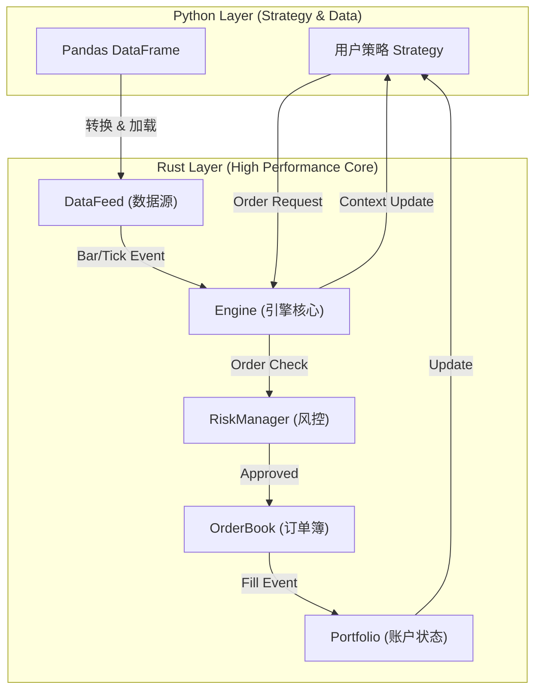
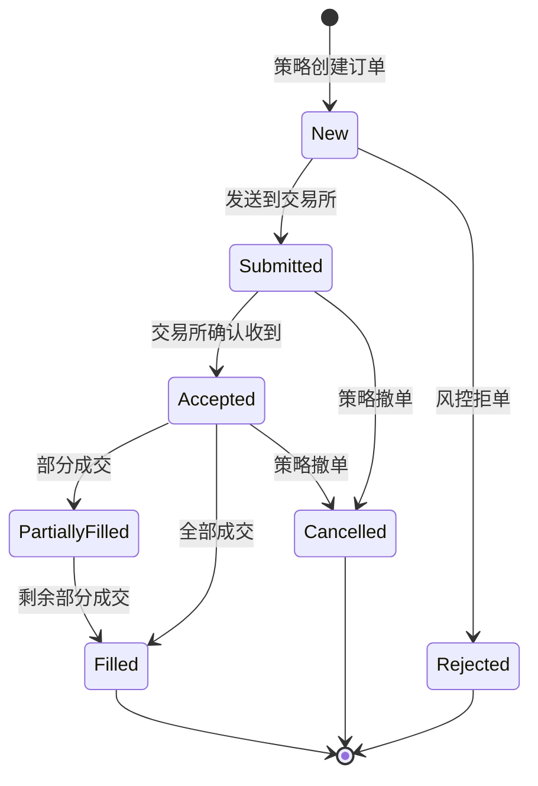

# 第 4 章：事件驱动回测原理

> ⏱️ 预计阅读 ~40 分钟 ｜ 🎯 难度 ★★★★☆（核心）

在第 1 章中，我们运行了一个简单的策略；在第 3 章中，我们准备好了数据。现在，让我们揭开 `AKQuant` 引擎盖下的秘密，从软件工程的角度深入理解**事件驱动 (Event-Driven)** 架构的设计原理。

## 学习目标

- 理解向量化回测与事件驱动回测的建模差异与适用边界。
- 掌握 AKQuant 引擎的核心组件、事件循环、撮合与风控框架。
- 建立时间推进、订单状态与回测可信度检查的系统视角。

## 前置知识

- 已完成前 1 到 3 章，对数据与首个策略有基本感知。
- 能读懂简单的类、配置对象与伪代码。

## 本章实践入口

- 主示例：[examples/textbook/ch04_comparison.py](https://github.com/akfamily/akquant/blob/main/examples/textbook/ch04_comparison.py)
- 进阶示例：[examples/25_streaming_backtest_demo.py](https://github.com/akfamily/akquant/blob/main/examples/25_streaming_backtest_demo.py), [examples/68_backtest_tick_demo.py](https://github.com/akfamily/akquant/blob/main/examples/68_backtest_tick_demo.py)（§4.16 Tick 输入与聚合语义）
- 函数式孪生示例：[examples/textbook/ch04_comparison_functional.py](https://github.com/akfamily/akquant/blob/main/examples/textbook/ch04_comparison_functional.py)
- 对应指南：[数据指南](../guide/data.md)

## 快速运行与验收

```bash
python examples/textbook/ch04_comparison.py
python examples/textbook/ch04_comparison_functional.py
```

验收要点：

1. 脚本能够输出向量化、Python 事件驱动、AKQuant 事件驱动三组结果。
2. 可以对比三种范式的执行速度与回测指标差异。
3. 能解释为何事件驱动更贴近真实交易状态机。

## 本章地图：先抓主线，再读扩展

如果你是第一次系统学习回测引擎，建议按下面顺序阅读，而不是从头到尾平均用力：

1. **第一遍只读主线必学**：4.1 -> 4.2 -> 4.3 -> 4.5 -> 4.7 -> 4.8 -> 4.9 -> 4.14
   这一遍的目标只有一个：建立“事件如何流动、订单如何成交、风控如何拦截”的完整心智模型。
2. **第二遍补读进阶选读**：4.4 -> 4.6 -> 4.10 -> 4.11 -> 4.12 -> 4.13 -> 4.15
   这一遍再去理解热启动、冲击成本、多标的时间流、盈亏口径和性能优化。

如果你在阅读时感觉信息量过大，优先记住一句话：

> **事件驱动回测 = 时间推进 + 状态更新 + 订单撮合 + 风控拦截。**

## 4.1 [主线必学] 回测系统的两种范式

量化回测系统主要分为两大类：**向量化回测 (Vectorized Backtesting)** 和 **事件驱动回测 (Event-Driven Backtesting)**。

为了直观理解这两种模式的区别，我们编写了一个对比脚本 `examples/textbook/ch04_comparison.py`，分别使用 **Pandas** (向量化)、**Backtrader** (Python 事件驱动) 和 **AKQuant** (Rust 事件驱动) 实现同一个双均线策略，用来观察不同范式在建模方式、接口体验和运行开销上的差异。

### 4.1.0 完整主示例（建议先通读）

```python
--8<-- "examples/textbook/ch04_comparison.py"
```

### 4.1.1 向量化回测 (Pandas)

向量化回测利用 Pandas/NumPy 的矩阵运算能力，一次性计算出所有时间点的信号。这在数学上等同于对整个时间序列矩阵进行线性代数变换。

```python
# Pandas 向量化回测核心逻辑 (节选自 examples/textbook/ch04_comparison.py)
def run_pandas_backtest(df):
    # 1. 计算指标 (一次性计算整列)
    df['ma5'] = df['close'].rolling(5).mean()
    df['ma20'] = df['close'].rolling(20).mean()

    # 2. 生成信号 (使用 np.where 全量生成)
    # 核心：必须使用 shift(1) 将信号后移一天，避免前视偏差 (Look-ahead Bias)
    df['signal'] = np.where(df['ma5'] > df['ma20'], 1, 0)
    df['position'] = df['signal'].shift(1)

    # 3. 计算收益
    df['strategy_return'] = df['position'] * df['close'].pct_change()
```

向量化回测的优点在于代码极简、计算效率极高（通常是毫秒级），因而很适合早期的 Idea 验证。它的代价则集中在两处：一是**前视偏差风险**，由于信号是全量一次性算出的，极易引入未来函数（如忘记 `shift(1)`）；二是**路径依赖缺失**，因为它跳过了逐笔成交过程，难以模拟撮合机制、滑点、资金占用等与“交易路径”强相关的状态。

### 4.1.2 事件驱动回测 (Backtrader & AKQuant)

事件驱动回测模拟了真实世界的时间流逝。它本质上是一个**无限循环 (Event Loop)**，不断地从队列中取出事件并处理。

**状态机 (State Machine)** 模型：

$$ State_{t+1} = f(State_t, Event_t) $$

其中 $State$ 包含账户资金、持仓、挂单等，$Event$ 包含行情更新、订单成交等。

**Backtrader (Python 经典框架)**：

```python
# Backtrader 策略逻辑 (节选)
class SmaCross(bt.Strategy):
    def next(self):
        # 每个时间步都会调用一次 next()
        if not self.position:
            if self.crossover > 0:
                self.buy() # 发出买单，将在下一根 Bar 成交
```

**AKQuant (Rust 高性能框架)**：

```python
# AKQuant 策略逻辑 (节选)
class AKQuantSmaStrategy(Strategy):
    def on_bar(self, bar: Bar):
        # 也是逐个 Bar 处理
        # 区别在于 AKQuant 底层循环由 Rust 实现，可减少部分 Python 解释器开销
        ma5 = ...
        if ma5 > ma20 and pos == 0:
            self.order_target_percent(...)
```

事件驱动回测的优势恰好补上了向量化的短板。其一是**零未来函数**：在处理当前 Bar 时，策略在物理上就无法访问下一个 Bar 的数据，未来函数无从谈起；其二是**高度仿真**：它支持限价单、止损单、复杂资金管理等微观结构模拟，更贴近真实交易。

至于**性能**，则需要更谨慎地看待。Backtrader 与 AKQuant 都属于事件驱动范式，其具体运行耗时会受到策略写法、数据规模、指标计算位置、回调频率和运行环境影响。AKQuant 将事件循环、撮合与状态管理放在 Rust 层实现，目标是在保持事件驱动精确性的同时减少 Python 层开销；但它是否快于其他框架，仍需结合具体场景实测，而非一概而论。

你可以运行以下命令亲自体验三者的差异：

```bash
python examples/textbook/ch04_comparison.py
```

## 4.2 [主线必学] AKQuant 架构深度解析 (Architecture Deep Dive)

`AKQuant` 采用了一种独特的**混合架构 (Hybrid Architecture)**，旨在结合 Python 的易用性和 Rust 的高性能。

### 4.2.1 核心设计理念：Rust Core + Python API

整个系统分为两个清晰的层级：

1.  **Rust Core (核心层)**：负责所有计算密集型任务。
    *   **Engine**：维护全局状态、资金、持仓、订单簿。
    *   **DataFeed**：高效的数据流管理。
    *   **Matching Engine**：订单撮合逻辑。
    *   **Risk Manager**：实时风控检查。
2.  **Python API (应用层)**：负责用户交互和策略逻辑。
    *   **Strategy**：用户编写策略的基类。
    *   **Indicator**：技术指标计算。
    *   **Plotting**：结果可视化。

这两层通过 **PyO3** 进行零开销绑定。当你在 Python 中调用 `self.buy()` 时，实际上直接触发了 Rust 层的函数调用，没有任何中间序列化成本。

### 4.2.2 系统组件图



### 4.2.3 关键组件详解

#### 1. Engine (引擎)
引擎是系统的调度中心 (Dispatcher)。它维护着全局时钟 (Global Clock) 和事件优先队列 (Priority Queue)。在 `AKQuant` 中，`Engine` 是一个 Rust 结构体，它完全接管了 Python 的控制流。它的职责是推进时间、分发事件、触发回调；而正因为整个循环以单线程极速运行，它得以避免 Python GIL 的锁竞争。

#### 2. DataFeed (数据源)
DataFeed 负责按时间顺序向引擎“滴灌”行情数据。在实现上，它在 Rust 中维护了一个时间排序的 B-Tree 或 Vec，确保数据严格按时间戳推送。也正是凭借这套有序结构，当回测多个标的时，DataFeed 能自动对齐时间，确保 `on_bar` 接收到的数据在时间轴上是同步的。

#### 3. StrategyContext (策略上下文)
StrategyContext 是 Python 策略与 Rust 引擎通信的桥梁。`StrategyContext` 在 Rust 中持有 Portfolio、Orders 等状态，并通过 PyO3 暴露给 Python。为保证内存安全（引擎状态会随事件持续变动，视图交给 Python 后可能失效），`self.ctx.positions`、`get_history` 等策略侧读取返回的是**当次调用的安全快照拷贝**，而非直接映射 Rust 内存的零拷贝视图；由于持仓/历史窗口通常很小，拷贝开销可忽略。真正的零拷贝发生在数据导入侧（`add_arrays` 借用 NumPy 缓冲入引擎）。

## 4.3 [主线必学] 配置系统详解 (The Configuration System)

`AKQuant` 拥有一个结构化的配置系统，旨在清晰地定义回测的“何时 (When)”、“何地 (Where)”、“何物 (What)”以及“如何 (How)”。

### 4.3.1 四大配置支柱

1.  **BacktestConfig (回测配置)**：定义**宏观场景**。
    *   **When**：`start_time`, `end_time`
    *   **What**：`instruments` (交易标的列表)
    *   **How**：`strategy_config` (策略配置)

2.  **InstrumentConfig (标的配置)**：定义**资产属性**。
    *   **What**：`symbol`, `multiplier` (合约乘数), `margin_ratio` (保证金率)
    *   **Cost**：`commission_rate`, `slippage` (标的特有滑点)

3.  **StrategyConfig (策略配置)**：定义**账户与执行**。
    *   **Capital**：`initial_cash`
    *   **Cost**：`commission_policy` / `commission_rate`
    *   **Execution**：`slippage` (全局滑点), `volume_limit_pct` (成交量限制)
    *   **Risk**：`risk` (风控配置)

4.  **RiskConfig (风控配置)**：定义**安全边界**。
    *   **Constraints**：`max_position_pct`, `max_drawdown`

### 4.3.2 配置示例

```python
from akquant.config import BacktestConfig, StrategyConfig, RiskConfig, InstrumentConfig

# 1. 定义风控
risk = RiskConfig(max_position_pct=0.1, stop_loss_threshold=0.8)

# 2. 定义策略账户
strategy_conf = StrategyConfig(
    initial_cash=1_000_000,
    commission_policy={"type": "per_unit", "value": 0.01},  # 每股 0.01 元
    slippage=0.0002,  # 万2滑点
    risk=risk
)

# 3. 定义特殊标的 (如期货)
rb_conf = InstrumentConfig(symbol="RB2305", multiplier=10, margin_ratio=0.1)

# 4. 组装回测配置
config = BacktestConfig(
    start_time="2023-01-01",
    end_time="2023-12-31",
    strategy_config=strategy_conf,
    instruments=["AAPL"],
    instruments_config={"RB2305": rb_conf}
)
```

## 4.4 [进阶选读] 状态快照与热启动 (State Snapshot & Warm Start)

这一节更偏向长周期回测、滚动训练和准实盘恢复。第一次阅读本章时，如果你还在建立“事件驱动回测到底怎么工作”的基础认知，可以先跳过，等理解 4.7 到 4.9 后再回来读。

作为事件驱动架构的一大优势，AKQuant 能够随时暂停并保存整个引擎的状态（Memory Dump），并在之后完全恢复。这种能力被称为**热启动 (Warm Start)**。

### 4.4.1 原理

由于 AKQuant 的核心状态（持仓、订单、资金）都由 Rust 的 `Engine` 结构体集中管理，我们可以利用 Python 的 `pickle` 协议将这个结构体序列化到磁盘。

当恢复时，我们反序列化 `Engine`，并重新连接数据源（DataFeed），使其无缝继续运行。

### 4.4.2 应用场景

1.  **超长周期回测**：可以将 10 年的回测拆分为 10 个 1 年的片段，并行运行或顺序运行。
2.  **滚动训练 (Rolling Walk-Forward)**：训练模型 -> 运行回测 -> 保存状态 -> 使用新数据微调模型 -> 恢复回测。
3.  **模拟实盘**：每天收盘后保存状态，第二天开盘前加载状态并接入实时行情。

详细使用方法请参考 [高级指南：热启动](../advanced/warm_start.md)。

### 4.4.3 佣金策略分层

AKQuant 当前支持三种公开佣金模式：

*   `percent`: 按成交额比例收费，适合传统“万三佣金”。
*   `fixed`: 每次成交固定金额，适合“每笔固定收 3 元”。
*   `per_unit`: 按成交数量线性收费，适合“每股/每手/每份收固定费用”。

推荐优先级如下：

1.  订单级 `commission={"type": ..., "value": ...}`。
2.  策略级 `strategy_commission[strategy_id]`。
3.  运行级 `commission_policy`。
4.  兼容入口 `commission_rate` 与市场默认值。

其中 `commission_rate` 仍保留，但它只表示 `percent` 模式的简写。如果你要表达按笔固定收费或按数量收费，推荐显式使用 `commission_policy`。


## 4.5 [主线必学] 撮合引擎揭秘 (Matching Engine Internals)

回测引擎的核心在于**撮合 (Matching)**：如何根据历史行情判断你的订单是否成交，以及以什么价格成交。

### 4.5.1 基于 Bar 的撮合逻辑

在没有 Tick 数据的情况下，我们通常使用 OHLCV 数据进行近似撮合。假设当前 Bar 的数据为 $(O, H, L, C, V)$。

1.  **市价单 (Market Order)**：
    *   **买入**：以 $Open$ 价（或 $Close$ 价，取决于策略是在开盘还是收盘下单）成交。
    *   **滑点**：通常在成交价基础上增加 $N$ 个跳 (Tick Size)。

2.  **限价单 (Limit Order)**：假设买入限价为 $P_{limit}$。
    *   **完全成交**：如果 $Low < P_{limit}$，说明盘中价格跌破了限价，订单必然成交。
    *   **无法成交**：如果 $Low > P_{limit}$，说明盘中最低价都高于限价，订单无法成交。
    *   **部分成交**：如果 $Low = P_{limit}$，情况比较复杂。通常保守起见，假设只有部分成交或不成交。

3.  **止损单 (Stop Order)**：假设卖出止损价为 $P_{stop}$。
    *   **触发**：如果 $Low < P_{stop}$，止损被触发，转为市价单卖出。
    *   **成交价**：通常取 $P_{stop}$ 或 $Low$ 中的较差者（模拟跳空低开的情况）。

### 4.5.2 涨跌停处理

在 A 股市场，涨跌停板会锁死流动性。

*   **涨停 (Limit Up)**：$High = LimitUp$。此时**买入**市价单无法成交，买入限价单也无法成交（除非排队在前）。
*   **跌停 (Limit Down)**：$Low = LimitDown$。此时**卖出**订单无法成交。

当前版本的 `AKQuant` 默认撮合逻辑**不会维护一套随市场制度动态变化的涨跌停规则表**。如果你的数据源已经提供了涨停/跌停或可买/可卖标记，建议通过 `Bar.extra` 等扩展字段把这些信息一并带入数据，再在策略或后续扩展撮合逻辑中消费这些字段。

## 4.6 [进阶选读] 滑点与冲击成本模型 (Slippage & Impact Models)

这一节适合已经完成基础回测后，再进一步提高结果可信度时阅读。对第一次上手的读者来说，先理解“能不能成交”，再理解“以多差的价格成交”，学习顺序会更自然。

真实交易中，你的买入行为会推高价格，卖出行为会压低价格。这种**冲击成本 (Market Impact)** 是大资金回测必须考虑的。

### 4.6.1 线性滑点模型

最简单的模型，假设滑点与交易量无关。

$$ P_{fill} = P_{market} \pm \text{Slippage} $$

其中 $\text{Slippage}$ 可以是固定值（如 0.01 元）或百分比（如 0.1%）。

### 4.6.2 平方根法则 (Square Root Law)

这是学术界和业界公认的冲击成本模型，由 Barra 提出。

$$ \text{Cost} \propto \sigma \times \sqrt{\frac{Q}{V}} $$

其中：

- $\sigma$：资产的波动率。
- $Q$：你的交易量。
- $V$：市场的总成交量。

这表明：**冲击成本与交易量的平方根成正比**。如果你想把交易量翻倍，冲击成本只会增加 $\sqrt{2} \approx 1.414$ 倍，而不是 2 倍。这为大资金拆单提供了理论依据。

## 4.7 [主线必学] 事件循环伪代码 (Event Loop Pseudo-code)

为了更清晰地理解 `AKQuant` 的运行机制，我们可以用伪代码描述其主循环：

```python
def run_backtest():
    engine = Engine()
    strategy = UserStrategy()
    data_feed = DataFeed(start_date, end_date)

    while not data_feed.is_finished():
        event = data_feed.next()
        engine.current_time = event.datetime
        engine.match_orders(event)
        strategy.on_bar(event)
        engine.emit_stream_event(event_type="bar", payload={"symbol": event.symbol})

    engine.generate_report()
```

这个循环确保了**时间流逝的单向性**，杜绝了未来函数。

### 4.7.1 `run_backtest(..., on_event=...)` 统一事件流

除策略回调外，`run_backtest` 还支持 `on_event` 参数，用于接收统一事件流（如 `bar`、`order`、`trade`、`risk`、`progress`、`equity`），常用于监控台、告警与审计落盘。

```python
import akquant as aq

events = []
result = aq.run_backtest(
    data=data_feed,
    strategy=MyStrategy,
    symbols="AAPL",
    on_event=events.append,
    stream_progress_interval=1,
    stream_equity_interval=1,
)
```

这个入口与策略类风格、函数式风格兼容，可以把策略逻辑与可观测性解耦。

## 4.8 [主线必学] 风控引擎 (Risk Engine)

在真实的交易系统中，**风控 (Risk Management)** 是最后一道防线。`AKQuant` 引擎内置了一个强大的预交易风控模块 (`RiskManager`)，它独立于策略逻辑之外，直接在引擎层面拦截不合规的订单。

### 4.8.1 为什么要预交易风控？

预交易风控之所以必要，是因为它要拦下几类典型的事故。最直接的是**胖手指 (Fat Finger)**——手抖多敲了一个零，导致下单数量巨大；其次是**逻辑 Bug**，策略代码写错了，可能导致无限循环下单或满仓梭哈；此外还有**合规要求**，某些基金有严格的行业集中度或杠杆限制，需要在下单前就被强制约束。

### 4.8.2 内置风控规则

`AKQuant` 的风控能力通常通过 `RiskConfig` 与策略级参数映射启用，常见约束包括：

1.  **单笔限制**：`max_order_size` / `max_order_value`。
2.  **持仓限制**：`max_position_size` / `max_position_pct`。
3.  **标的限制**：`restricted_list` / `sector_concentration`。
4.  **账户级限制**：`max_account_drawdown` / `max_daily_loss` / `stop_loss_threshold`。

### 4.8.3 配置示例

推荐在回测配置阶段声明风控参数：

```python
import akquant as aq

risk = aq.RiskConfig(
    max_order_size=5_000,
    max_order_value=200_000,
    max_position_pct=0.2,
    restricted_list=["ST0001"],
    max_daily_loss=0.05,
)

config = aq.BacktestConfig(
    strategy_config=aq.StrategyConfig(
        initial_cash=1_000_000,
        risk=risk,
    )
)

result = aq.run_backtest(
    strategy=MyStrategy,
    data=data_feed,
    symbols="AAPL",
    config=config,
)
```

当策略发出的订单违反上述规则时，`Engine` 会拒绝该订单，并返回 `Rejected` 状态和具体的错误信息（如 `Risk: Position value ratio 15.00% exceeds limit 10.00%`）。

---

## 4.9 [主线必学] 订单生命周期与状态机 (Order Lifecycle)

在事件驱动系统中，理解订单的状态流转至关重要。一个订单从产生到最终成交，会经历严格的状态机变换。



### 4.9.1 关键状态解析

1.  **New (新建)**：
    *   策略调用 `self.buy()` 后，订单对象被创建，但在风控检查通过前，状态为 `New`。
    *   此时订单尚未进入撮合队列。

2.  **Submitted (已提交)**：
    *   订单通过了客户端风控（如资金检查），已发送到交易所（或模拟撮合引擎）。
    *   在实盘中，这代表网络请求已发出。

3.  **Accepted (已受理)**：
    *   交易所确认收到订单。在 `AKQuant` 的回测模式中，通常 `Submitted` 后立即转为 `Accepted`（除非模拟了网络延迟）。

4.  **Filled (全部成交)**：
    *   订单的所有数量都已成交。此时会触发 `on_trade` 回调，并且持仓和资金会相应更新。

5.  **Rejected (已拒绝)**：
    *   订单因某些原因被拒绝。常见原因：
        *   **资金不足 (Insufficient Margin)**：可用资金不足以支付保证金或全额。
        *   **非法数量 (Invalid Quantity)**：例如 A 股买入必须是 100 的整数倍。
        *   **废单**：价格超过涨跌停板。

## 4.10 [进阶选读] 撮合引擎机制 (Matching Engine Mechanics)

如果 4.5 已经帮助你理解了“撮合是什么”，这一节就是把它进一步展开成更接近真实系统的实现细节。它适合作为回测精细化阶段的补充，而不是第一次阅读时的入口。

`AKQuant` 的模拟撮合引擎 (`SimulatedExecutionClient`) 旨在尽可能逼真地模拟真实交易所的撮合逻辑。

### 4.10.1 撮合逻辑 (Matching Logic)

对于每一根新的 Bar (或 Tick)，引擎会遍历所有活跃订单进行撮合：

1.  **市价单 (Market Order)**：
    *   **成交价**：取决于 `fill_policy` 指定的 `FillMode`（见下文）。
    *   **成交量**：尽可能全部成交，除非受限于当根 Bar 的成交量（Volume Limit）。

2.  **限价单 (Limit Order)**：
    *   **买入单**：当 `Low Price <= Limit Price` 时成交。
        *   *价格优化*: 如果 `Open Price < Limit Price`，则以 `Open Price` 成交（模拟开盘撮合）。
    *   **卖出单**：当 `High Price >= Limit Price` 时成交。
    *   **成交价**：也就是常说的“价格优先”。

3.  **止损单 (Stop Order)**：
    *   当市场价格突破触发价 (`Trigger Price`) 时，止损单会转化为市价单或限价单。
    *   `AKQuant` 支持**穿透检查 (Gap Detection)**：例如，昨日收盘 100，今日跳空低开 90，如果你有 95 的止损卖单，引擎会正确地在 90 成交（而不是 95），真实模拟跳空风险。

### 4.10.2 成交模式 (Fill Mode)

为了平衡回测的严谨性和灵活性，`AKQuant` 提供五个命名成交模式（`FillMode`），从 `akquant` 顶层导入：

| `FillMode` | 成交价 | 说明 |
| :--- | :--- | :--- |
| `NextOpen()` | 下一根 Bar 开盘价 | 默认，无未来函数 |
| `NextClose()` | 下一根 Bar 收盘价 | |
| `NextAverage()` | 下一根 Bar OHLC4 均价 | |
| `NextHighLowMid()` | 下一根 Bar HL2（高低中价） | |
| `CurrentClose()` | 当根 Bar 收盘价 | 支持 `timer_fill_timing` 参数 |

早期版本使用扁平的 `fill_policy` dict（`price_basis` × `bar_offset` × `temporal`），其笛卡尔积会产生非法/无效组合。新版收敛为上述命名模式，每个模式只携带对其有意义的参数。旧的 dict 形式与 `make_fill_policy(...)` 已移除，传入会抛出 `TypeError`。

### 4.10.3 成交时序策略 (Timer Fill Timing)

只有 `CurrentClose` 支持 `timer_fill_timing` 参数，用于控制 `on_timer` 下单的撮合时点（akquant 的 timer 是一等成交事件）：

| `timer_fill_timing` | 描述 | 典型场景 |
| :--- | :--- | :--- |
| `"immediate"` (默认) | timer 触发即在当根收盘价成交 | 定时调仓后立即成交的仿真 |
| `"deferred"` | timer 不构成成交点，顺延到下一根 Bar | 更保守的“信号与成交分离”建模 |

它只影响 `on_timer` 订单，对普通 `on_bar` 订单无影响。其余四个模式的 `on_timer` 订单都在下一根 Bar 成交。

推荐统一使用：

```python
import akquant
from akquant import CurrentClose

result = akquant.run_backtest(
    data=data,
    strategy=MyStrategy,
    fill_policy=CurrentClose(timer_fill_timing="deferred"),
)
```

### 4.10.4 滑点与冲击成本 (Slippage & Impact)

回测中最容易高估收益的因素是忽略了交易成本。`AKQuant` 支持配置滑点模型：

$$ \text{Final Price} = \text{Execution Price} \times (1 \pm \text{Slippage Rate}) $$

*   **买入**：价格向上滑动（买得更贵）。
*   **卖出**：价格向下滑动（卖得更便宜）。

此外，你还可以设置 **Volume Limit**（例如 10%），限制策略在单根 Bar 上的成交量不超过市场总成交量的 10%，以模拟流动性限制。

### 4.10.5 配置分层与覆盖优先级

`AKQuant` 在成交相关参数上采用统一的四层覆盖模型（从高到低）：

1.  **订单级**：`buy/sell/submit_order` 传入 `fill_mode/slippage/commission`（`fill_mode` 为 `FillMode` 对象）。
2.  **策略映射级**：`strategy_fill_policy/strategy_slippage/strategy_commission`（按 `strategy_id/slot`，`strategy_fill_policy` 值为 `FillMode`）。
3.  **运行级**：`run_backtest(...)` 全局参数（例如 `fill_policy=NextOpen()`、`slippage`）。
4.  **市场默认**：market model 的内建默认规则（费率、制度等）。

实务建议：
*   单策略场景可先用运行级，局部例外再用订单级覆盖。
*   多策略槽位场景优先使用 `strategy_*`，避免不同策略互相覆盖全局参数。

## 4.11 [进阶选读] 资金与风控管理 (Portfolio & Risk)

### 4.11.1 资金校验 (Pre-trade Check)

在订单提交前，Rust 层的 `RiskManager` 会进行严格的资金校验：

1.  **计算成本**：
    *   股票: `Price * Quantity`
    *   期货: `Price * Quantity * Multiplier * MarginRatio`
2.  **计算费用**：预估佣金、印花税等。
3.  **比较**：`Total Cost > Free Cash` ?
    *   如果资金不足，订单会被**自动拒绝 (Rejected)**，或者根据配置**自动缩减数量 (Auto-resize)** 以适应剩余资金。

### 4.11.2 T+1 制度模拟

对于 A 股市场，`AKQuant` 内置了 T+1 规则支持：

*   **可用持仓 (Available Position)**：当日买入的股票，在当日的 `available_positions` 中为 0，只有到下一个交易日才会释放。
*   **卖出检查**：卖出时检查 `available_positions` 而非总持仓。

这意味着如果你在 T 日买入，尝试在 T 日卖出，订单会被拒绝，错误信息提示 "Insufficient available position"。

当前范围说明：
*   `t_plus_one` 是**运行级/市场级**开关，不是按 `strategy_id` 的分层参数。
*   即使启用了多策略槽位，不同策略仍共享同一市场制度与可用持仓结算口径。

## 4.12 [进阶选读] 多标的与时间流 (Time Flow & Multi-Asset)

这部分是从“单标的事件驱动”迈向“多标的统一时间流”的关键一步。若你当前只在做单标的策略，可以先知道结论，后续做全市场选股时再回来细读。

在回测多个标的（例如全市场选股）时，时间的同步至关重要。

`AKQuant` 的 `DataFeed` 实现了一个**全局优先队列 (Global Priority Queue)**。无论你加载了多少个 CSV 文件或 DataFrame，引擎都会将它们的数据打散并重新排序。

**工作流程**：

1.  加载 AAPL 的数据，放入队列。
2.  加载 MSFT 的数据，放入队列。
3.  `DataFeed.sort()`：对所有事件按时间戳进行全局排序。
4.  **Event Loop**：引擎调用 `feed.next()`，总是返回时间戳最小的那个事件。

这意味着，即使 AAPL 和 MSFT 在同一分钟都有数据，引擎也会按顺序处理它们（虽然逻辑上是同一时刻），确保了多标的策略在任何时刻看到的都是“当时”的全局状态。

### 4.12.1 为什么 AKQuant 要统一用 UTC

理解 `AKQuant` 的事件驱动架构时，有一个非常关键但很容易被忽略的点：

> **引擎排序和状态推进依赖 UTC，时区只是显示层语义。**

原因很简单。事件驱动系统必须回答一个严肃问题：当多个市场、多个频率、多个语言运行时同时出现事件，谁先处理？

如果每条数据都带着各自市场的本地时间字符串，系统很难稳定地比较和排序；而一旦统一成 UTC 纳秒时间戳，这个问题就变成了纯数值排序，语义最清晰，也最不容易出错。

因此，AKQuant 采用三层分工：

1. **引擎层**
   - 使用 UTC 纳秒时间戳推进全局时钟
   - 决定事件队列的先后顺序

2. **结构化接口层**
   - `event_time` 保存 UTC 纳秒时间戳
   - `event_time_iso`、`bar.timestamp_iso`、`trade.timestamp_iso` 等保存 UTC ISO 8601 字符串
   - 这些字段适合日志、审计、JSON 导出和跨 Python/Rust 协作

3. **显示层**
   - `self.now`
   - `self.to_local_time(...)`
   - `self.format_time(...)`
   - 这些接口把 UTC 转成策略配置的本地时区，便于人类阅读

举个例子，北京时间 `2023-01-03 15:00:00+08:00` 的日线收盘 Bar，在结构化层可能会显示为：

```text
2023-01-03T07:00:00Z
```

这不是时区错乱，而是同一个事实的两种表达：

- 对引擎来说，它需要一个全球唯一、可排序的 UTC 时刻
- 对用户来说，他通常更关心“这是本地市场的几点”

你可以把 AKQuant 的时间设计总结成一句话：

> **UTC 负责让系统正确，本地时区负责让结果好读。**

## 4.13 [进阶选读] 盈亏计算原理 (PnL Mathematics)

理解 `AKQuant` 的盈亏计算逻辑，对于分析策略表现至关重要。

### 4.13.1 浮动盈亏 (Unrealized PnL)

浮动盈亏反映了当前持仓的未结收益。

$$ \text{Unrealized PnL} = (\text{Current Price} - \text{Entry Price}) \times \text{Quantity} \times \text{Multiplier} $$

*   **Entry Price (入场均价)**：采用加权平均法计算。

### 4.13.2 平仓盈亏 (Realized PnL)

当平仓发生时，浮动盈亏转化为平仓盈亏。`AKQuant` 采用 **FIFO (先进先出)** 原则进行结算。

**示例**：

1.  买入 100 股 @ 10 元。
2.  买入 100 股 @ 12 元。
3.  卖出 100 股 @ 15 元。

**结算**：
卖出的 100 股会优先匹配第一笔 10 元的买单。

$$ \text{Realized PnL} = (15 - 10) \times 100 = 500 $$

剩余持仓：100 股 @ 12 元。

### 4.13.3 总权益 (Total Equity)

$$ \text{Total Equity} = \text{Cash} + \sum (\text{Market Value of Positions}) $$

其中市值计算包含保证金占用（对于期货/期权）。

## 4.14 [主线必学] 常见问题排查 (Troubleshooting)

如果你的订单没有成交，请检查以下清单：

1.  **价格未触发**：
    *   限价买单价格必须 `>=` Bar Low。
    *   限价卖单价格必须 `<=` Bar High。
2.  **资金/持仓不足**：
    *   检查日志中是否有 `Order Rejected: Insufficient cash` 或 `Insufficient available position`。
    *   A 股回测请注意 T+1 限制。
3.  **成交量限制**：
    *   如果你设置了 `volume_limit`，而当根 Bar 成交量很小，订单可能只成交一部分或完全不成交。
4.  **最小交易单位 (Lot Size)**：
    *   A 股买入数量必须是 100 的整数倍。
5.  **时间窗口**：
    *   确保数据覆盖了订单产生的时间段。

## 4.15 [进阶选读] 性能优化与内存管理

`AKQuant` 之所以快，除了 Rust 本身的高性能外，还做了大量内存优化：

1.  **避免 DataFrame 碎片化**：历史数据在 Rust 中以连续内存块（Vector）存储，而不是 Python 的分散对象。
2.  **按需计算**：指标（Indicator）通常是增量计算的（Streaming），而不是每次重算整个序列。
3.  **对象池 (Object Pooling)**：虽然目前主要通过栈分配优化，但设计上避免了频繁的大对象创建和销毁。

---

## 4.16 [进阶选读] Tick 输入与聚合语义 (Tick Input & Aggregation)

前面各节的事件流都以 `Bar` 为单位。但引擎的事件层本就是 `Event::{Bar, Tick, ...}` 的枚举，撮合层同样认 tick——所以 `run_backtest(data=...)` 除 `Bar` 列表外，还接受 `Tick` 列表与两者的混合列表。

这一节讲两种模式的取舍，以及三个**反直觉但必须理解**的语义。可运行的对照演示见 [examples/68_backtest_tick_demo.py](https://github.com/akfamily/akquant/blob/main/examples/68_backtest_tick_demo.py)。

### 4.16.1 纯 tick 模式：退化 bar 表示法

不传 `freq` 时，tick 直接进入事件流：只触发 `on_tick`，**不**触发 `on_bar`。

关键设计是**退化 bar 表示法**：tick 写入历史缓冲区时，`open = high = low = close = price`。这样列式 OHLC 的存储结构与字段查询都无需改动，`get_history(count, symbol, "close")` 在 tick 历史上就是「最近若干笔成交价」。

代价也从这个表示法直接推出：**tick 的最高价恒等于最低价**。于是 ATR、振幅这类依赖真实 H/L 的指标在纯 tick 数据上只会恒为 0。AKQuant 不让它静默返回 0——若某标的全程只有 tick、从未有过任何 bar，会话结束时会抛 `StrategyConfigurationError`。

> **设计原则：静默失效比报错危险。** 一个恒为 0 的 ATR 不会让回测崩溃，它会让你基于无意义的数字做出决策。这类"不报错也不工作"的路径是本章 4.14 节排查清单的重点，也是 AKQuant 在 tick 支持上反复权衡的主轴。

### 4.16.2 `freq` 聚合模式：因果顺序为什么决定时间戳约定

传入 `freq="1min"` 后，原始 tick 仍照常投递给 `on_tick`，同时把区间内的 tick 聚合成 bar 投递给 `on_bar`——于是拿到完整 OHLC 语义与全部指标（含 ATR 等 H/L 类）。

这里有一个值得单独理解的工程决策：**合成 bar 的时间戳打在区间结束（下一区间起点前 1 纳秒），而不是区间起点。**

原因是回测与实盘的时间语义不同：

| | 实盘 | 回测 |
| --- | --- | --- |
| bar 何时被消费 | 下一区间首个 tick 到达时才发出，**墙钟顺序即因果顺序** | tick 与合成 bar 进同一 feed，再按时间戳**排序** |
| 用区间起点的后果 | 无害 | bar 排到形成它的 tick **之前** |

用区间起点在回测里会造成**前视偏差**：策略在 09:30:00 就收到一根 `high` 来自 09:30:15 的 bar，等于读到了尚未发生的数据。示例 68 的输出可以直接核对这一点——合成 bar 落在 `09:30:59`，晚于形成它的全部 tick。

### 4.16.3 成交量口径：单笔量与累计量

聚合器的 `on_tick(symbol, price, volume, timestamp_ns)` 有两种 volume 口径，由构造参数选择：

*   **累计口径**（实盘默认）：CTP 推来的 `Volume` 是当日累计量，聚合器算相邻两笔的差分。首笔会被播种为自身值（差分为 0），否则第一根 bar 会吞掉一整天的成交量。
*   **单笔口径**（回测）：`Tick.volume` 就是这一笔的量，聚合器直接求和。

两者不可混用：用累计口径处理单笔量，会让每个标的的**首笔成交量被丢弃**。示例 68 验证了 `100+200+150+50 = 500` 一笔不落。

### 4.16.4 其余边界

*   `freq` 只支持整数分钟（`"1min"` / `"5min"` / `"1h"`）；`"30s"` 会报错并指向 `feed_adapter.resample`，不静默取整。词汇与 pandas `to_offset` 对齐。
*   末尾未满一个周期的 tick 不产生 bar（聚合器不提供 flush）。
*   预计算指标（`indicator_mode="precompute"`）不支持含 tick 的输入，请改用增量指标或 `freq` 聚合。
*   构造 `Bar` / `Tick` 时**时间戳必须是真实纳秒**：构造器会把小于 `1e10` 的值乘 `1e9`，传 `100` 之类的小整数会被静默改写。

完整清单见[数据指南的「Tick 输入」一节](../guide/data.md)。

---

## 本章小结

### 必须掌握

- 事件驱动回测在真实交易仿真能力上显著优于纯向量化回测。
- 理解订单状态、撮合规则与风控约束，是保证回测可信度的前提。

### 理解即可

- AKQuant 的 Python/Rust 分层既是性能设计，也是职责分层设计。

### 实践提醒

- 阅读本章时先抓住事件流主线，再回头查撮合、UTC 和风控细节。

## 主线推进

第 1 章里，那条贯穿全书的最小双均线（MA5/MA20）策略只是被“跑通”了一遍——我们看到了收益与回撤，却没有追问引擎是如何把一根根 Bar 变成一笔笔成交的。本章把同一条策略放回引擎盖下重新审视：它不再是一段会输出数字的脚本，而是一个在事件循环里被反复调用的状态机。我们用 `examples/textbook/ch04_comparison.py` 让这条双均线策略分别以 Pandas（向量化）、Backtrader 与 AKQuant（事件驱动）三种方式各跑一遍，从而亲眼看清：同样的金叉死叉逻辑，在“一次性矩阵运算”和“逐 Bar 撮合 + 风控拦截”两种范式下，建模方式、可信度与运行开销有何不同。至此，主线策略已经从“能运行”推进到“能解释它为什么这样成交”——下一章我们将基于这套事件驱动的认知，正式动手编写和打磨自己的策略逻辑。

## 延伸阅读

**经典著作**

- Chan, E. P. *Algorithmic Trading: Winning Strategies and Their Rationale*，Wiley, 2013 —— 系统讨论回测流程、前视偏差与数据陷阱，可对照本章 4.1 的两种范式与 4.14 的排查清单。
- Narang, R. K. *Inside the Black Box: A Simple Guide to Quantitative and High-Frequency Trading*（第 2 版），Wiley, 2013 —— 从系统视角拆解 Alpha、风控与执行模块，呼应本章 4.2 架构与 4.8 风控引擎。
- Harris, L. *Trading and Exchanges: Market Microstructure for Practitioners*，Oxford University Press, 2003 —— 讲透限价单、止损单与撮合机制的市场微观结构，对应本章 4.5 与 4.10 的撮合逻辑。
- de Prado, M. L. *Advances in Financial Machine Learning*，Wiley, 2018 —— 关于回测可信度、滑点与成本建模的进阶参考，延伸本章 4.6 冲击成本与 4.13 盈亏口径。

**官方文档与工具**

- [Backtrader 官方文档](https://www.backtrader.com/docu/) —— 本章 4.1.2 对比所用的 Python 事件驱动框架。
- [PyO3 用户指南](https://pyo3.rs/) —— 理解本章 4.2.1 中 Python 与 Rust 零开销绑定的底层机制。
- [pandas 官方文档](https://pandas.pydata.org/docs/) —— 本章 4.1.1 向量化回测所依赖的数据处理库。

**本书相关**

- [AKQuant 的时间与时区](../guide/quant_basics.md)、[时区处理指南](../advanced/timezone.md) —— 配合本章 4.12.1 理解引擎为何统一使用 UTC。
- [高级指南：热启动](../advanced/warm_start.md) —— 展开本章 4.4 的状态快照与热启动机制。
- [数据指南](../guide/data.md) —— 配合本章实践入口，准备多标的回测所需的统一时间流数据。

## 课后练习

### 基础题

1. 在主示例中修改滑点或手续费参数，比较收益与回撤变化。

### 应用题

1. 记录三种回测范式的运行时长，并解释差异来源。

### 综合题

1. 人工构造一笔“部分成交”场景，验证订单状态流转是否符合预期。

??? note "参考答案要点（先独立思考再展开）"

    **基础题**：滑点/手续费上调会拉低收益、抬高对换手的惩罚，高频策略受影响尤甚——说明成本假设直接决定回测可信度。

    **应用题**：向量化最快（一次性矩阵运算），事件驱动较慢（逐 Bar + 撮合 + 风控）；差异来自路径依赖建模与 Python/Rust 层开销，需结合数据规模实测。

    **综合题**：用 `volume_limit` 或限价单制造部分成交，观察 New→Submitted→PartiallyFilled→Filled 的流转，并核对 `on_order` / `on_trade` 是否按预期多次触发。

## 常见错误与排查

1. 订单没有成交：优先检查价格是否触发、资金是否足够，以及是否受成交量限制。
2. 结果好得异常：检查是否误用了未来数据，或忽略了滑点、手续费与市场制度。
3. 多标的时间错位：确认数据是否统一为可排序时间戳，并检查时区显示与引擎排序的分层。
